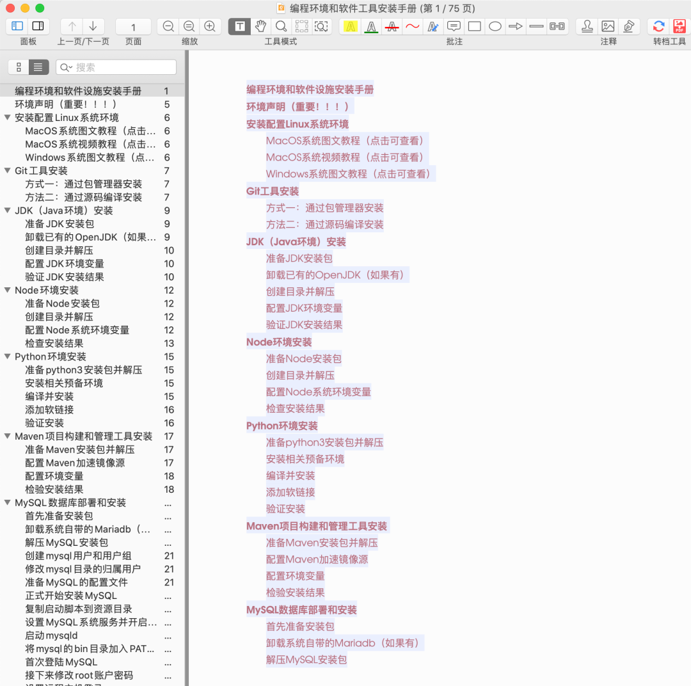

是个痛点
====

经常听到有小伙伴反馈和提问有关编程环境搭建和基础软件设施安装的相关问题。

每次都是照着网上现搜的帖子操作，一顿操作猛如虎，一看结果各种有问题，要不报错，要不环境起不来，等等。

装个环境就浪费了很多时间，而且过了一段时间又忘，还得重新搜帖子，该踩的坑一个都不少...

* * *

《[安装手册](https://wwzt.lanzoul.com/idMbR0ngthmd)》
======

这样吧，既然大家有这方面需求，想来想去，关于这个问题，我还是决定写一个事无巨细的`PDF`文档，把所有**编程环境**和**基础软件设施**的安装过程给详细地记录下来了。

这样大家以后在装环境的时候，就不用漫天去找各种博客、帖子参考了。

而且，对于想学`Linux`基本使用的初学者，正好可以就着这个机会练练手，常见命令都涉及了。

接下来看看这个`PDF`手册长啥样吧，随便截了几张图：

文档`70`多页，每天晚上写一点，花了近`10`天。

* * *

写这个文档不为别的，一是方便我自己参考，不然每次装东西漫天找博客有点烦，还不一定靠谱；另外分享出来，也希望对大家有帮助。

不过由于时间太紧、个人精力有限，有疏忽和不当的地方在所难免，还希望大家能见谅。

而且这个 PDF 文档也会持续更新，新东西再往里加，有些东西还可以继续优化。

最后，用到的**软件安装包**也都提前为大家备好了，文档里有写，需要的都可以自取。

* * *

每天进步一点点，Peace

慢一点 才能更快
