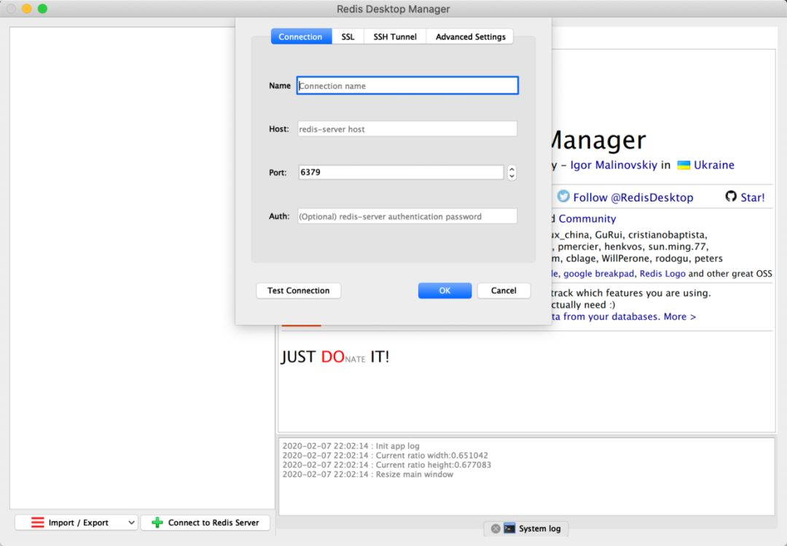

小伙伴们 大家好！  

之前很多朋友问过我，作为一个程序员会用到哪些软件和工具。

正好趁着我这次开发机转移，在新机上安装各种开发环境和软件，就这个机会跟大家分享一下好了！

小伙伴们有什么好用的软件或工具也欢迎评论区安利一下，大家一起交流进步，我就先抛砖引玉了。

这次装机，我把我的所有常用软件分为了 **5 大类**：

*   社交 / 娱乐 / 上网
    
*   办公软件
    
*   效率和美化
    
*   UP 主必备
    
*   程序员生产力工具
    

接下来一一介绍。

**_0x01._ 社交 / 娱乐 / 上网**
------------------------

社交、娱乐、上网等软件估计大家都大同小异，各有各的使用习惯和取舍。

这地方我必须要提的，可以说极大提升了我休闲时间幸福感的软件那就是：

**Apple Music**

不得不说，正版专辑真的挺香，音质也非常好，我沉迷于其中无法自拔！

_**0x02.**_ **办公软件**
--------------------

**1、微软 Office 家族**

        这个我想不用多介绍了

**2、PDF Professional**

一直以来用得非常顺手的一款 PDF 阅读器，不管是编辑、做笔记、目录、书签、合并 / 分离、转换 PDF 文件都非常方便。

**3、Flowchart Designer**

平时写技术博客，文中的原理图、流程图等都是用它来完成的，基本满意

**4、有道云笔记**

作为一个跨平台、跨终端的笔记软件，还算是非常好用的，我的所有技术文章基本都放在里面。

**5、百度云网盘**

百度你 6，我充会员还不行嘛！

_**0x03.**_ **效率和美化**
---------------------

**1、Alfred**

用 Mac 的没有不用 Alfred 的吧，我想应该不用多介绍了，是一个高效的启动器，谁用谁知道。

**2、Magnet**

用 Windows 系统的小伙伴都知道，可以自由拖动窗口在屏幕周边进行吸附从而分屏，但 Mac 默认是没有这个功能的。Magnet 是我用的一个还不错的分屏软件，直接支持窗口拖动吸附，非常方便

**3、CleanMyMac X**

非常好用的系统管理软件，系统清理、程序卸载、健康监控、文件粉碎都能完成，关键是界面真的很舒适。

**4、4K Live Wallpaper**

4K 动态壁纸软件，纯粹为了酷炫的效果，非常适合视网膜屏幕

**_0x04._UP 主必备**
-----------------

**1、Final Cut Pro X**

作为一个程序员 UP 猪，我频道里所有的视频大部分都是用 Final Cut Pro X 剪辑完成的，着着实实的 UP 主生产力工具。

**2、Premiere**

除了上面的 Final Cut Pro X 可以剪视频，Premiere 则更加专业和复杂，强大肯定是不用说了，关键有个问题是这玩意经常性地崩溃。。。

**3、Davinci Resolve**

达芬奇数字调色软件，我正好最近偶尔学一学，挺高深的，目前仍处于踩坑摸底阶段。

**4、ArcTime Pro**

给视频批量做字幕的必备软件。

**5、Ps 和 Lr**

Photoshop 和 Lightroom 应该也不用多介绍了，处理图片，做图片封面，我用的都是它们。

_**0x05.**_ **程序员生产力工具**
------------------------

**1、SecureCRT**

SecureCRT 是一款 SSH 远程连接服务器的终端软件，同时也支持 `Telnet`和 `rlogin`等多种协议，我已经用了多年了，形影不离。

**2、Termius**

Termius 和上面的 SecureCRT 一样，也是一个 SSH 终端软件，功能也非常强大，App Store 里即可直接安装，很方便。

**3、IntelliJ IDEA**

这软件可真是吃饭家伙。作为一个 Java 后端开发，所有的 Java 代码基本都是在里面写的，不愧是 Java 领域最炫酷 IDE！

**4、Chrome 浏览器**

        这个我想不用多介绍了，程序员必备浏览器。

**5、iTerm2**

Mac OS 自带的终端其实也可以用，只不过有时候不太方便，定制自由度也不够。iTerm2 则是一个可以完全替代系统自带终端的神器，尤其配合 `ZSH`这个 Shell 来使用，可以说非常地舒适。

**6、Visual Studio Code**

这个应该也不用多介绍，微软出品，跨所有平台的文本编辑器，我一般也就临时用来看看代码，写写 Markdown 格式的文章，当然它的功能远不止这些。

**7、VMware Fusion**

VMware Fusion 是一款可以媲美 Parallels Desktop 的虚拟机软件，我一直用的这个。

**8、Navicat**

我重度依赖的一款数据库可视化软件，支持多种数据库，支持大部分在现今数据库管理系统中使用的功能，包括存储过程、事件、触发器、函数、视图等。

**9、Postman**

作为一个后端开发，API 接口的测试少不了它。

**10、Redis Desktop Manager**

RDM 和上面的 `Navicat`差不多，是一款 Redis 缓存的可视化软件，平时可视化操作 Redis 少不了它。

**11、Dash**

Dash 既是一个强大的程序员开发文档管理器、也是一个方便的代码片段管理工具，可以说解决了程序员的两大痛点。

**12、Wireshark**

比较好用的抓包工具、看报文的工具。有了这个软件，TCP/IP 协议学起来可以说非常具象了，有啥不懂的，直接抓个包分析一下报文，一目了然。
