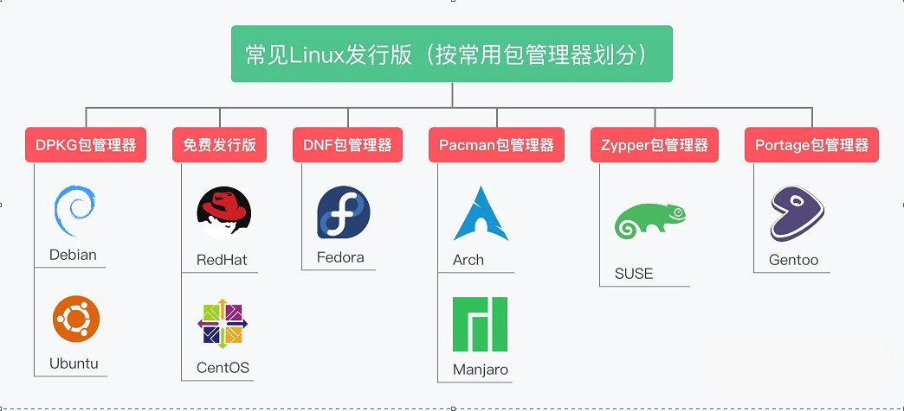
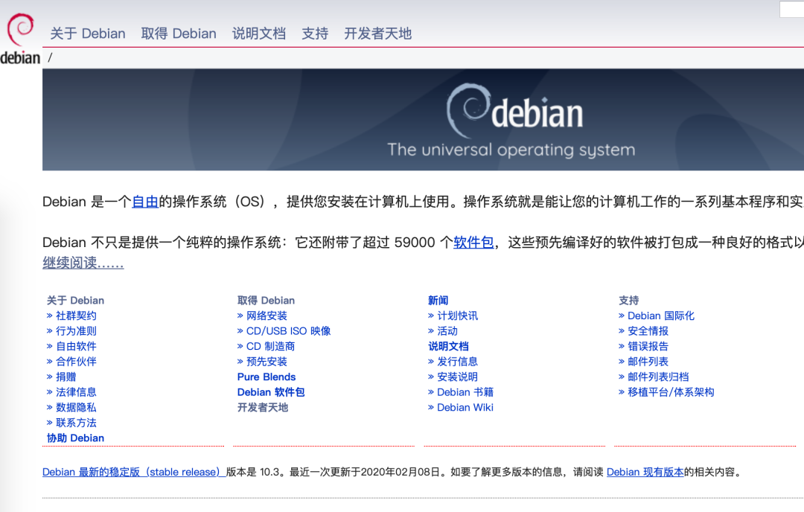
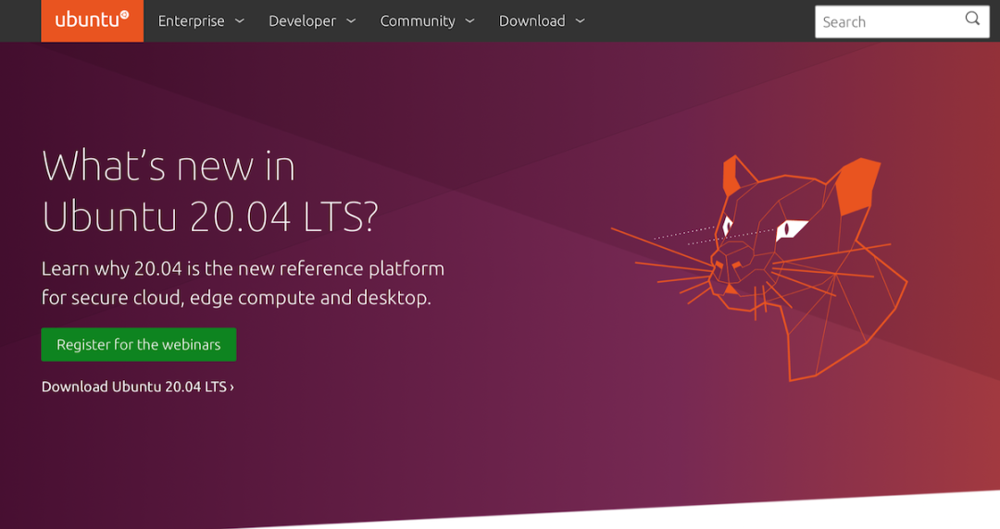
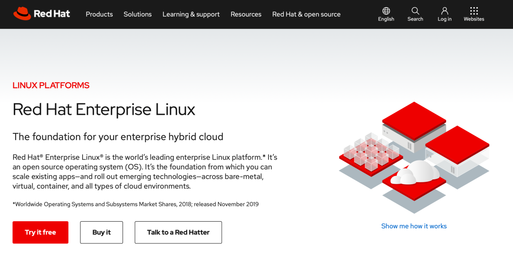
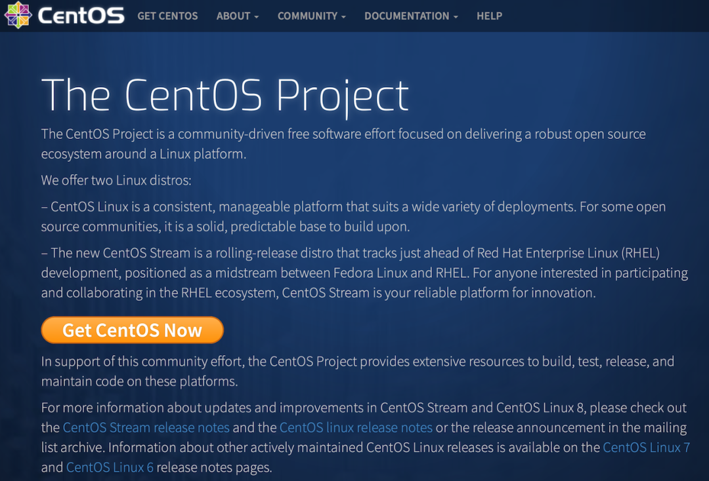
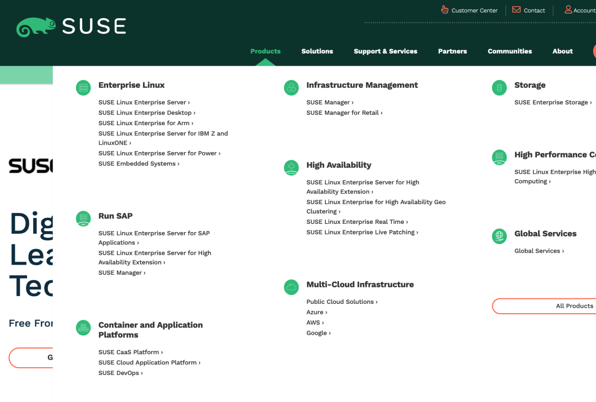
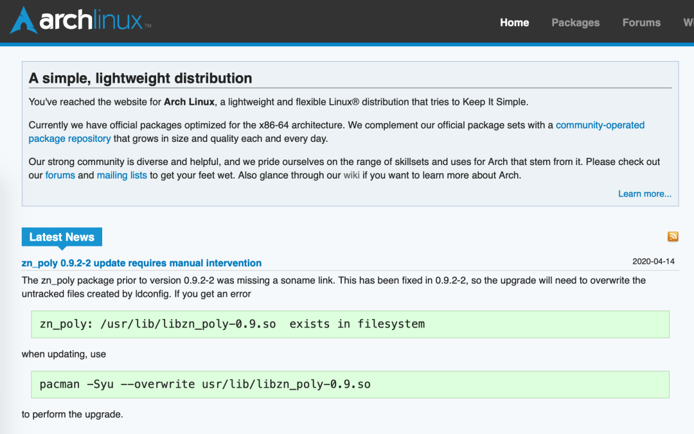
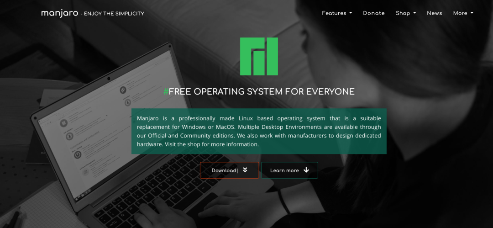
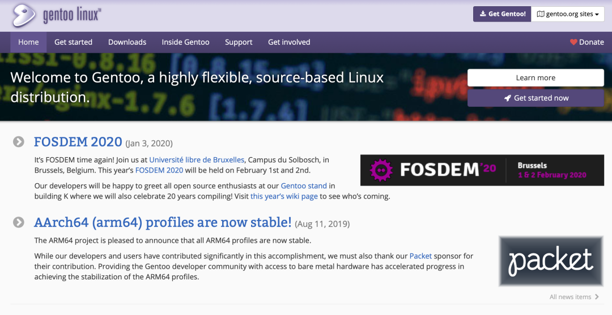

在之前的两篇文章中：

*   《[**人手一套 Linux 环境搭建之：macOS 版本教程**](wiki/03/04/002/01)》
    
*   《[**人手一套 Linux 环境搭建之：Windows 版本教程**](wiki/03/04/003/01)》
    

详细演示了如何在`Windows`系统和`macOS`系统上基于虚拟机来打造**学习和实验用**的`Linux`环境，这两篇文章中安装的`Linux`系统都是`CentOS`这个发行版，于是一些小伙伴发出了**致命三连击**：

*   为啥不选用其他类型的`Linux`系统呢？
    
*   还有哪些`Linux`系统可供选用呢？
    
*   我到底该选哪一种`Linux`操作系统呢？
    

得嘞，我写文章还不行嘛。

不过由于个人能力和见识有限，如有不当之处，还请批评指出，一起交流进步。

* * *

眼花缭乱！
=====

`Linux`系统的种类实在是太多了，具体的发行版种类让人看得眼花缭乱，本文就试着来总结一波，**理一理**、**顺一顺**，帮助我们做到心里有数。

单谈`Linux`的概念实在是太泛了。严格来讲，`Linux`只能说是一种操作系统的**内核**，所以我们通常所说的 **“Linux 操作系统”** 一般指的是 **采用 Linux 作为内核** 的操作系统！

首先我们选两个常见的维度，来**做个分类**吧。

* * *

#### 按是否商业版来划分

现有的`Linux`发行版操作系统，可以划分为由商业公司维护的**商业版本**和由开源社区维护的**免费发行**版本。

商业版`Linux`系统典型的代表那就是`RedHat Enterprise Linux`，而平时我们所常用的`Ubuntu`、`CentOS`、`Debain`这种则一般属于免费发行版。

**有人会说，Linux 不是开源的吗？不应该都是免费的吗？**

是的，`Linux`内核是开源的，但是 **开源≠免费**，我们可以理解为付费的是它的服务或者商业支持，所以有些`Linux`的发行版它也有它所谓的商业版。

当然这个角度我们不用纠结太多，一般个人使用，用免费发行版比较多。

* * *

#### 按包管理器来划分

**首先，什么是包管理器呢？**

这么说吧，如果没有包管理器这个东西的存在，那估计仅仅是`Linux`系统上的软件安装，怕是就要劝退很多用户了，因为很多的**软件依赖处理**会让人抓狂。

因此简单起见，我们可以将包管理器理解为，用来为`Linux`系统上的软件`安装`、`卸载`、`升级`、`查询`提供支持的组件，所以对于用户使用来说，一般是一组工具命令集。

目前`Linux`世界里的包管理种类繁荣，选几个最主流的，可以大致梳理成如下表格所示，每一种都有对应的 Linux 发行版代表：

<table data-tool="mdnice编辑器"><thead><tr><th>包管理器名称</th><th>常用标志性指令</th><th>代表系统举例</th></tr></thead><tbody><tr><td>DPKG</td><td>dpkg、apt</td><td>Debain、Ubuntu 等</td></tr><tr><td>RPM</td><td>rpm、yum</td><td>RedHat、CentOS 等</td></tr><tr><td>Pacman</td><td>pacman</td><td>Arch、Manjaro 等</td></tr><tr><td>DNF</td><td>dnf</td><td>Fedora</td></tr><tr><td>Zypper</td><td>zypper</td><td>SUSE</td></tr><tr><td>Portage</td><td>emerge</td><td>Gentoo</td></tr></tbody></table>

用一个脑图来总结一下可能会更加形象：

所接下来分别针对这里面的几个主流使用的`Linux`发行版系统来大致唠一唠。

* * *

Debian
======

`Debian`和`Ubuntu`是一个派系的，但界面可能没有`Ubuntu`那么华丽，但是比较稳定，也适合用作服务器操作系统。`Debian`在开源圈子用得十分广泛，也有一大批开源爱好者活跃于其中。

* * *

Ubuntu
======

`Ubuntu`界面比较华丽，包管理器很完善，社区也非常活跃，个人用户确实很多，所以从市面上看的确比较大众化。

* * *

RedHat
======

`RHEL（Red Hat Enterprise Linux）`毕竟是商业版`Linux`系统，一般多用于企业生产环境，提供完善的商业支持，在性能、稳定性方面也有很大的保障。

* * *

CentOS
======

`CentOS`可以理解为是基于`RedHat`商业版系统的社区编译重发布版，完全开源免费，因此相较于其他一些免费的`Linux`发行版会更加稳定，也因此一般企业里常用作服务器操作系统。

* * *

Fedora
======

`Fedora`其实和`RedHat`也同属一个派系，背后的支撑企业也是红帽子公司。但是`Fedora`是免费发行版，而且更加侧重于新技术的试验和加持，因此稳定性方面的考量较`CentOS`会稍微次要一些。

* * *

SUSE
====

`SUSE`背后也算是有大公司的支持了，目前主要也还是多用于企业用户。

* * *

Arch
====

`Arch`的确比较适合好奇心强的人尝鲜，它的官方`Wiki`做得好，`AUR`仓库很繁荣，适合`DIY`玩家去折腾，确实也吸引了不少粉丝。

* * *

Manjaro
=======

`Manjaro`可以看成是`Arch Linux`的衍生分支，既包含了`Arch`的常见优点，但也对用户友好，注重体验和稳定性。`Manjaro`的安装和使用都比较方便，目前使用用户非常多。

* * *

Gentoo
======

`Gentoo`适合极客范化的折腾，也比较适合有特殊需要和特殊化定制的需求，总体来说比较小众。但是用得很 6 的大佬们都说好，因为这些大佬们大多有系统洁癖，控制欲很强，什么都需要自己编译、自己定制，这个对他们来说简直就是天堂了。

* * *

其他 Linux 发行版
============

上文中只是介绍了比较主流和常用的`Linux`发行版，实际上各种各样的`Linux`发行版和其衍生系统数不胜数，在此也不一一列举了。

* * *

选用建议
====

*   如果是完全 0 基础的新手，只是想入门`Linux`的生态，体验`Linux`界面，那`Ubuntu`就非常合适
    
*   如果喜欢折腾和 DIY，好奇心满满，可以试试`Arch`、`Manjaro`、`Gentoo`这些
    
*   如果想用来部署服务，考虑稳定性，那`CentOS`、`Debian`都是不错的选择
    

当然这仅仅只是参考，最终的选择还是看个人需求和兴趣！

* * *

小调研：你在用哪种 Linux 系统呢？
====================

* * *

每天进步一点点，Peace！
