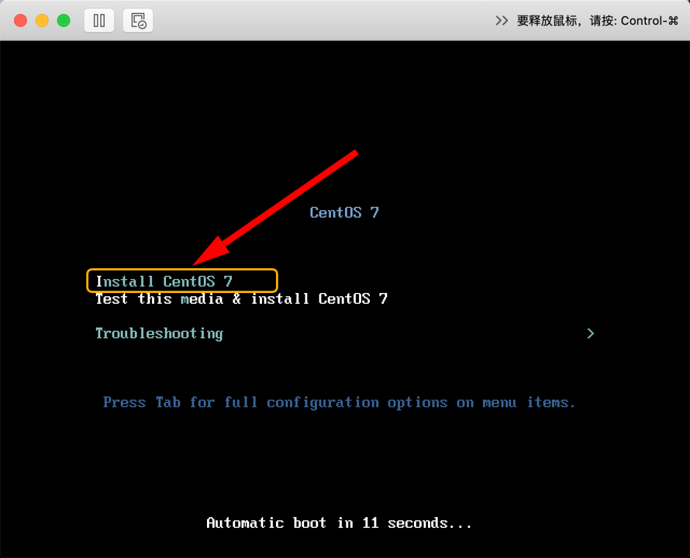
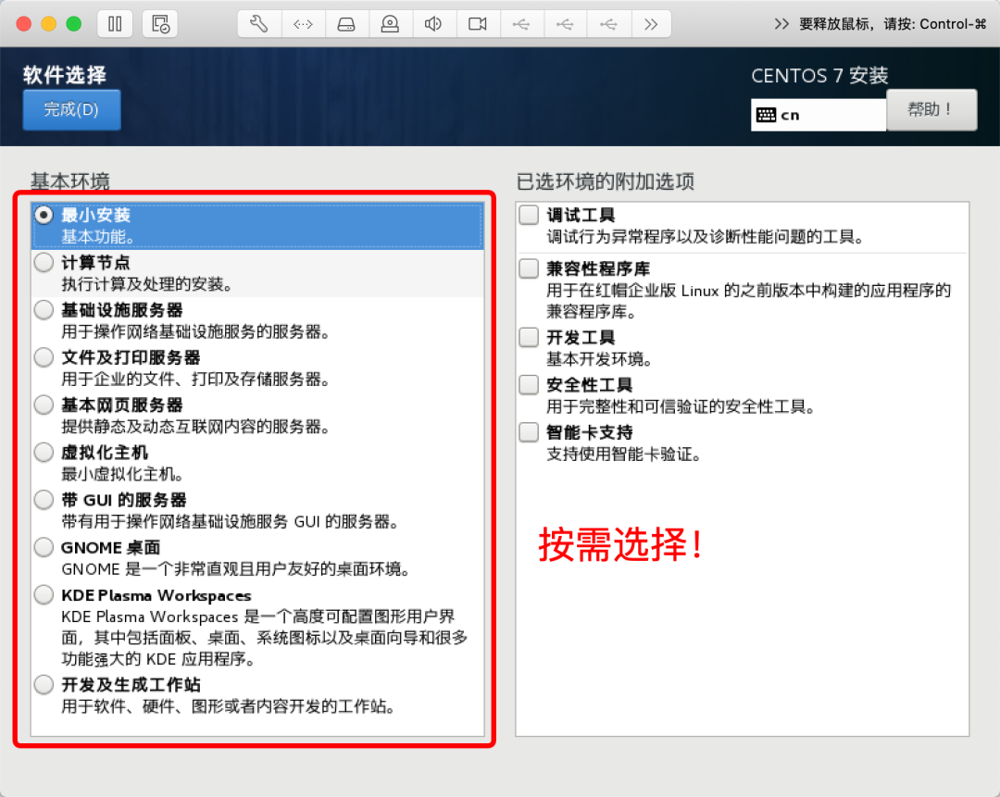

* * *

憋说了，整一套吧！
=========

本文准备从 0 开始，一步步搭建一套属于自己的**多节点 Linux 系统环境**，这将是后续**学 Linux**、**用 Linux**、**Linux 环境编程**、**应用和项目部署**、**工具实验**等一系列学习和实践的基石，希望对小伙伴们有帮助。

提前备好 Linux 编程实验环境非常重要，建议人手一套，这样以后每当学完一个理论知识需要实践时，立马就可以拿到上面去练手了。

因此本文先把环境给搭建起来！

* * *

软件准备
====

*   `VMware`虚拟机软件：本文使用的是`VMware Fusion 10.1.0`版本
*   `CentOS`操作系统`ISO`镜像：`CentOS 7.4 64位`
*   SSH 终端软件：`SecureCRT`
*   SFTP 文件传输工具：`Transmit`
*   物理宿主机系统：`macOS Catalina 10.15.4`
    

安装 Linux 操作系统
=============

**1、创建新的虚拟机**


**2、选择固件类型**


默认即可

**3、选择自定义设置**


**4、进入自定义设置**

我们初步需要自定义的主要也就是**处理器**、**内存**、**硬盘**，可以根据宿主机性能按需分配。


**5、启动虚拟机**


如果有权限提示，记得打开权限允许，否则可能会报错


正式点击启动键，过程中各种提示权限的允许动作，建议都通过一下。

**6、进入系统安装界面**



**7、选择安装语言**


**8、选择预安装的软件**




**9、配置分区**


没有特别需求可以选择自动分区，大家如果有需要可以自定义分区。

**10、进入正式安装过程**


**11、安装完成并重启**


**12、进入新系统**


* * *

系统是装好了，但还有几个问题
==============

**问题一：** 虚拟机内 Linux 系统与外网无法连通


**问题二：** 虚拟机内 Linux 系统与外部宿主机无法连通

比如我这里的物理宿主机的 IP 地址为：`192.168.31.35`


**问题三：** 虚拟机内 Linux 系统节点与节点之间无法连通（如果装了多个 Linux 节点的话）

* * *

网络配置（极其重要！）
===========

**1、首先尝试查看虚拟机系统的 IP 地址**

使用命令`ifconfig`进行查看。我们会发现装好的系统并没有为它设置 IP 地址。

**2、设置虚拟机与物理宿主机的网络连接**


首先选择**桥接模式**，另外由于我的物理主机是通过 WiFi 的方式连接到路由器最终访问外网，所以此处我选择的是`Wi-Fi`这一项


小伙伴们可以按实际情况进行选择。

**3、为虚拟机配置固定静态 IP**

首先使用`dhclient`工具为本机分配一个网络内可用的 IP 地址：


接下来编辑虚拟机系统网卡配置，将上面分配所得的 IP 地址配置进去：

使用命令编辑：`vim /etc/sysconfig/network-scripts/ifcfg-ens33`

修改配置如下：

```
TYPE=Ethernet
PROXY_METHOD=none
BROWSER_ONLY=no
BOOTPROTO=static
DEFROUTE=yes
IPV4_FAILURE_FATAL=no
IPV6INIT=yes
IPV6_AUTOCONF=yes
IPV6_DEFROUTE=yes
IPV6_FAILURE_FATAL=no
IPV6_ADDR_GEN_MODE=stable-privacy
NAME=ens33
UUID=824ec4bd-a9ae-4410-8346-17ce7f3dd111
DEVICE=ens33
ONBOOT=yes
IPADDR=192.168.31.110
NETMASK=255.255.255.0
GATEWAY=192.168.31.1
DNS1=119.29.29.29


```

尤其注意下图红色标记部分的配置：


编辑完成，重启网络设置即可

`systemctl restart network.service`

* * *

检查安装配置结果
--------

**1、首先检查 IP 配置结果**


**2、检验虚拟机系统网络和外界的连通性**

包括检查和外网的连通、和物理宿主机的连通、以及和兄弟节点（前提是你安装了多个虚拟机系统节点的话）之间的连接


3、反向检查物理宿主机和虚拟机系统网络的连接性


至此，大功告成！

* * *

SSH 远程连接
========

在宿主机通过 SSH 终端连接虚拟机内 Linux 系统，成功！


* * *

SFTP 文件传输
=========

在宿主机通过 SFTP 工具即可访问虚拟机内 Linux 节点，从而可以实现本地和服务器的文件互传


这样一来，一个可用的 Linux 节点就打造完成了！

* * *

何不再多弄几个节点？
==========

可以完全重复以上步骤再打造出多个 Linux 节点，当然**更简单的方式**则是直接通过上面已经装好了的虚拟机节点**直接克隆**，来快速生成其他节点。


克隆完成之后，只需要再配置一下新节点的网络即可。

* * *

后记
==

好啦，现在**多节点的 Linux 环境**终于搭建完成了，后续不管是 **学 Linux**、**用 Linux**，还是 **Linux 环境编程**、**应用和项目部署**、**工具实验**，都有可以动手实践的地方了。

* * *

每天进步一点点，Peace！
