* * *

其实 Windows 版的操作总体也大差不差，只是部分操作界面有点小变化。

还是那句话，既然学编程，提前备好 Linux 系统环境非常重要，建议人手一套，这样方便后续 **学 Linux**、**用 Linux**、**Linux 环境编程**、**应用和项目部署**、**工具实验**等一系列学习和实践

* * *

软件版本
====

*   物理宿主机系统：`Windows 10` 专业版
*   虚拟机软件：`VMware Workstation 10.0.1`版本
*   `CentOS`操作系统`ISO`镜像：`CentOS 7.4 64位`
*   SSH 终端软件：`SecureCRT`
*   SFTP 文件传输工具：`WinSCP`
    

安装 Linux 操作系统
=============

**1、创建新的虚拟机**


**2、选择虚拟机硬件兼容性**


默认即可

**3、加载 Linux 系统 ISO 镜像**

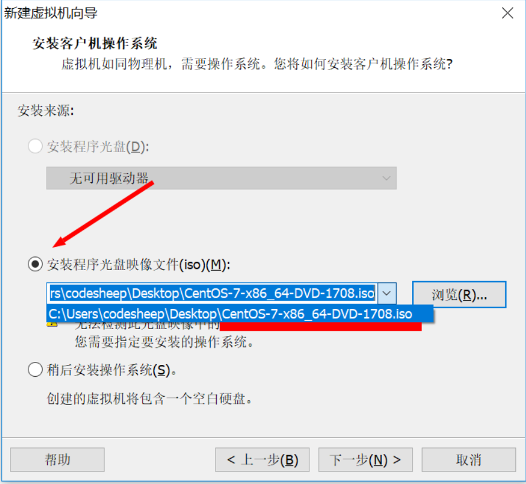


**4、虚拟机命名并存储**


**5、自定义虚拟机配置**

处理器按需配置：


内存按需配置：


网络部分选择「桥接模式」即可：

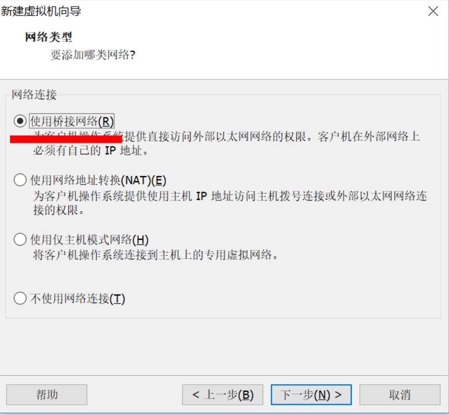

I/O 控制器选择默认即可：


硬盘类型选择默认即可：


硬盘容量按需分配：


**6、安装设置，开启安装**

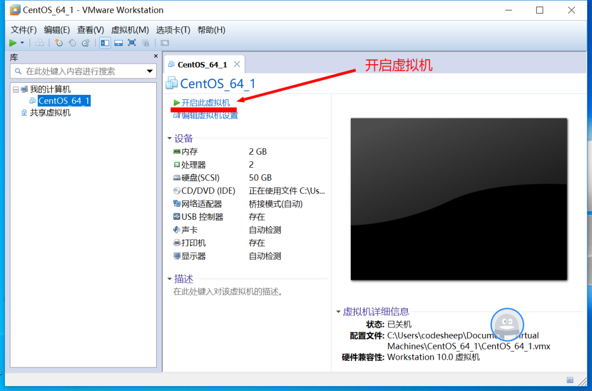

**7、进入系统安装界面**

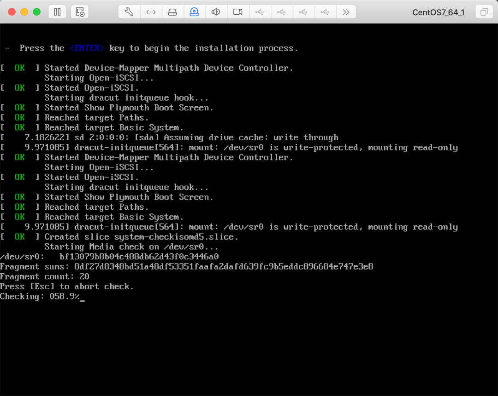

**8、选择安装语言**


**9、选择预安装的软件**

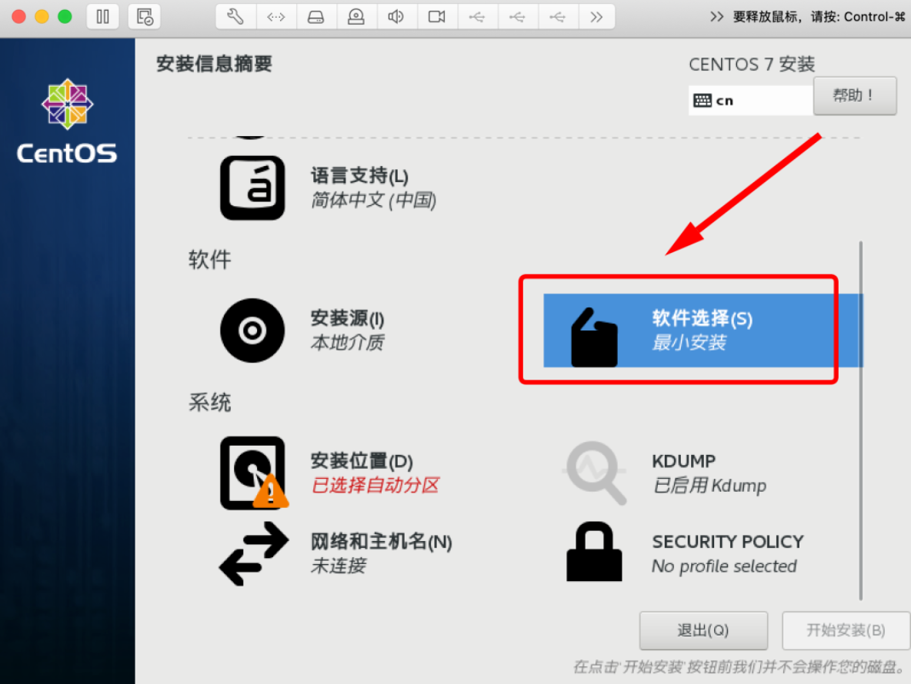

**10、配置分区**


没有特别需求可以选择自动分区，大家如果有需要可以自定义分区。

**11、进入正式安装过程**


**12、安装完成并重启**

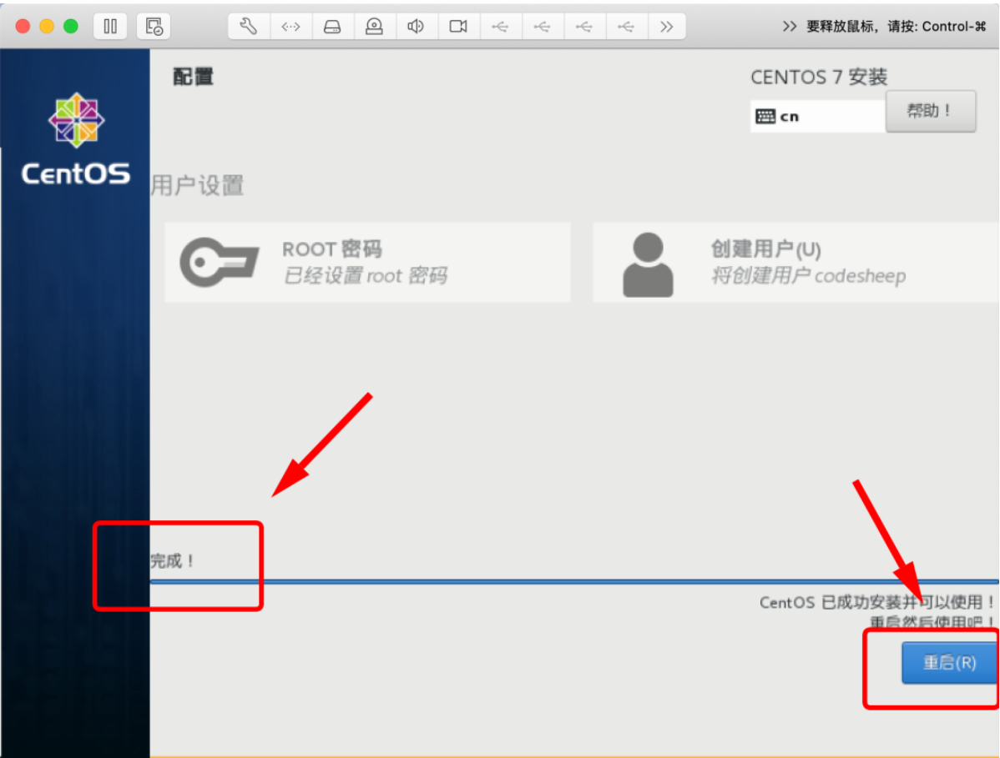

**13、进入新系统**


* * *

系统是装好了，但还有几个问题
==============

**问题一：** 虚拟机内 Linux 系统与外网无法连通

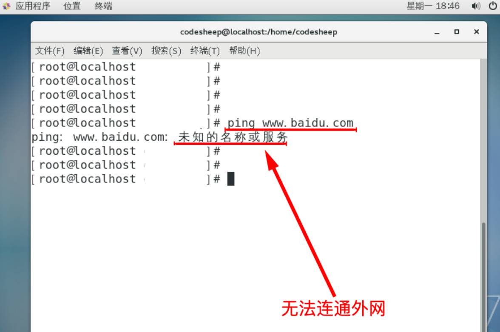

**问题二：** 虚拟机内 Linux 系统与外部宿主机无法连通

比如我这里的物理宿主机的 IP 地址为：`192.168.31.156`

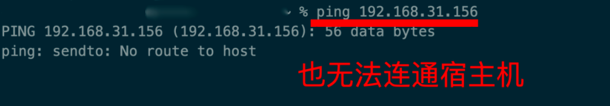

**问题三：** 虚拟机内 Linux 系统节点与节点之间无法连通（如果装了多个 Linux 节点的话）

* * *

网络配置（极其重要！）
===========

**1、首先尝试查看虚拟机系统的 IP 地址**

使用命令`ifconfig`进行查看。我们会发现装好的系统并没有为它设置 IP 地址。

**2、设置虚拟机与物理宿主机的网络连接**


选择**桥接模式**，并选择桥接到物理宿主机的上网网卡即可：

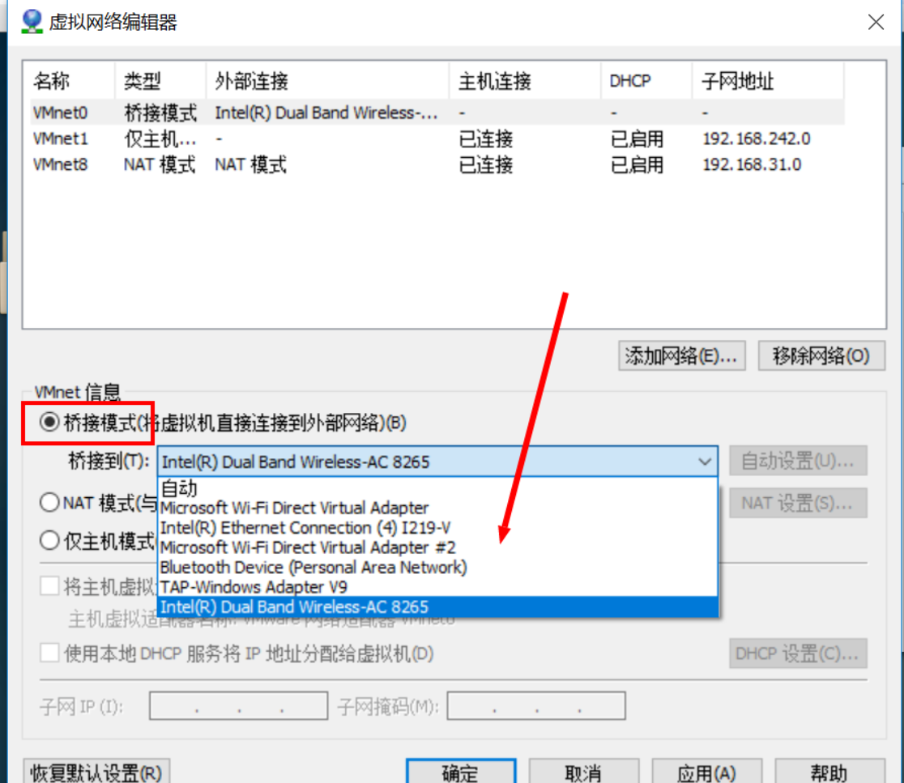

小伙伴们可以按实际情况进行选择。

**3、为虚拟机配置固定静态 IP**

首先使用`dhclient`工具为本机分配一个网络内可用的 IP 地址：

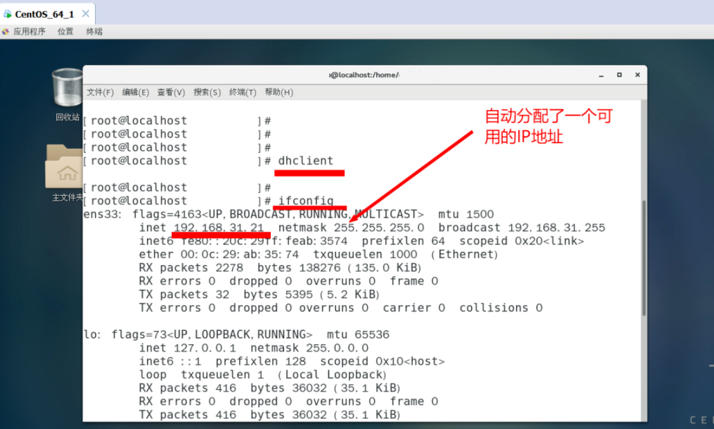

接下来编辑虚拟机系统网卡配置，将上面分配所得的 IP 地址配置进去：

使用命令编辑：`vim /etc/sysconfig/network-scripts/ifcfg-ens33`

修改配置如下：

```
TYPE=Ethernet
PROXY_METHOD=none
BROWSER_ONLY=no
BOOTPROTO=static
DEFROUTE=yes
IPV4_FAILURE_FATAL=no
IPV6INIT=yes
IPV6_AUTOCONF=yes
IPV6_DEFROUTE=yes
IPV6_FAILURE_FATAL=no
IPV6_ADDR_GEN_MODE=stable-privacy
NAME=ens33
UUID=824ec4bd-a9ae-4410-8346-17ce7f3dd111
DEVICE=ens33
ONBOOT=yes
IPADDR=192.168.31.21
NETMASK=255.255.255.0
GATEWAY=192.168.31.1
DNS1=119.29.29.29


```

尤其注意下图红色标记部分的配置：

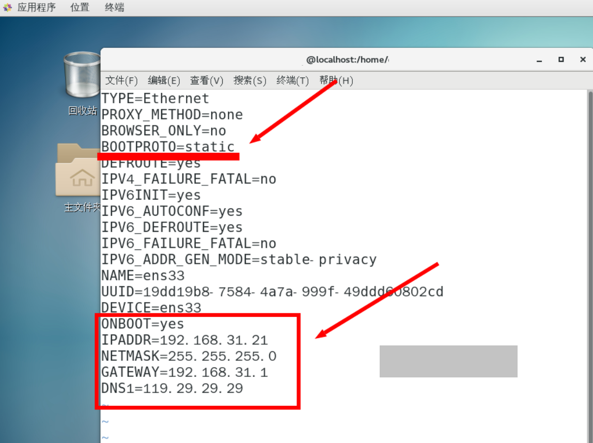

编辑完成，重启网络设置即可

`systemctl restart network.service`

* * *

检查安装配置结果
========

**1、检验虚拟机系统网络和外界的连通性**

包括检查和外网的连通、和物理宿主机的连通、以及和兄弟节点（前提是你安装了多个虚拟机系统节点的话）之间的连接

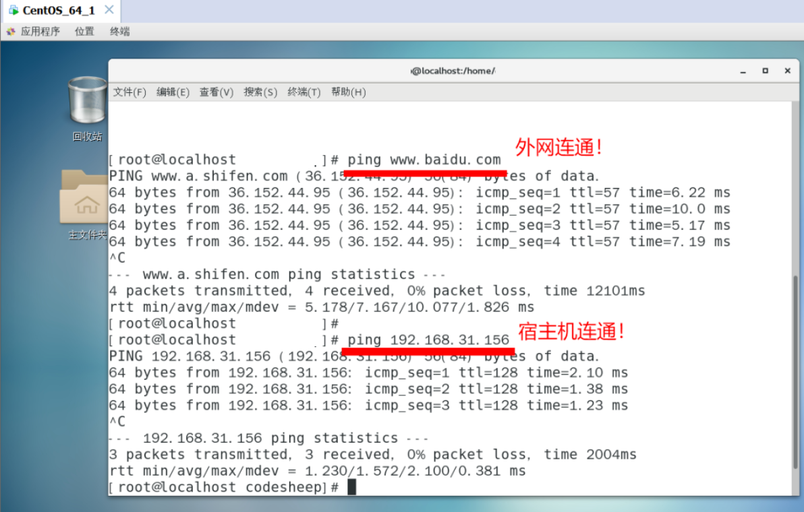

**2、反向检查物理宿主机和虚拟机系统网络的连接性**

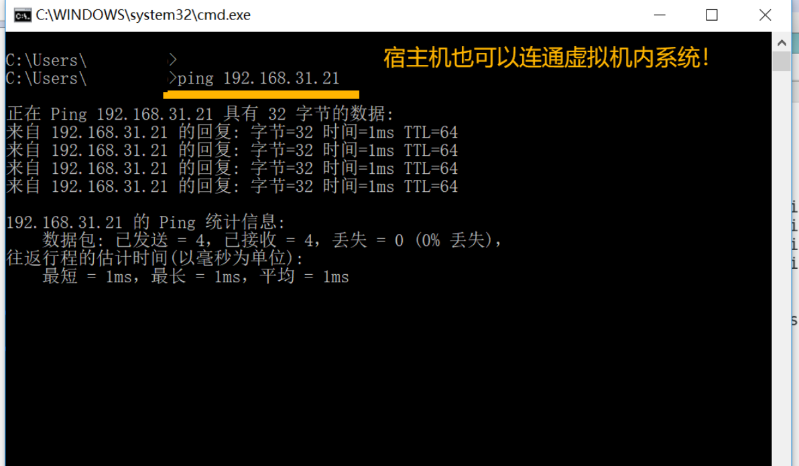

至此，大功告成！

* * *

SSH 远程连接
========

在宿主机通过 SSH 终端连接虚拟机内 Linux 系统，成功！

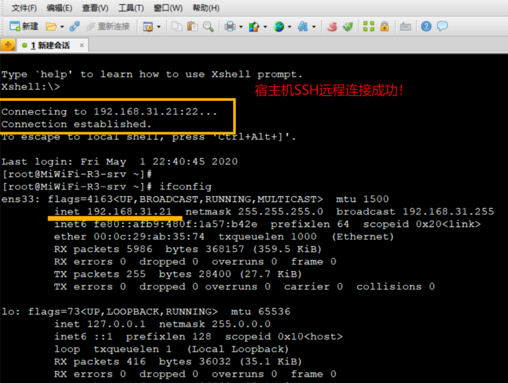

* * *

SFTP 文件传输
=========

在宿主机通过 SFTP 工具即可访问虚拟机内 Linux 节点，从而可以实现本地和服务器的文件互传

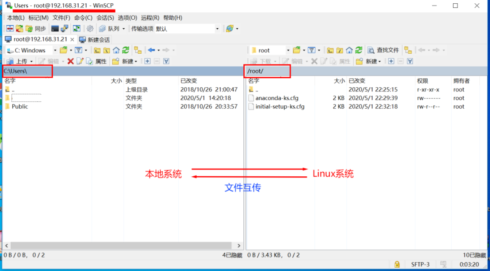

这样一来，一个可用的 Linux 节点就打造完成了！

* * *

再多弄几个节点
=======

可以完全重复以上步骤再打造出多个 Linux 节点，当然**更简单的方式**则是直接通过上面已经装好了的虚拟机节点**直接克隆**，来快速生成其他节点。


克隆完成之后，重新配置一下新节点的网络即可。

* * *

后记
==

好啦，现在**多节点的 Linux 环境**终于搭建完成了，后续不管是 **学 Linux**、**用 Linux**，还是 **Linux 环境编程**、**应用和项目部署**、**工具实验**，都有可以动手实践的地方了。

* * *

每天进步一点点，Peace！
