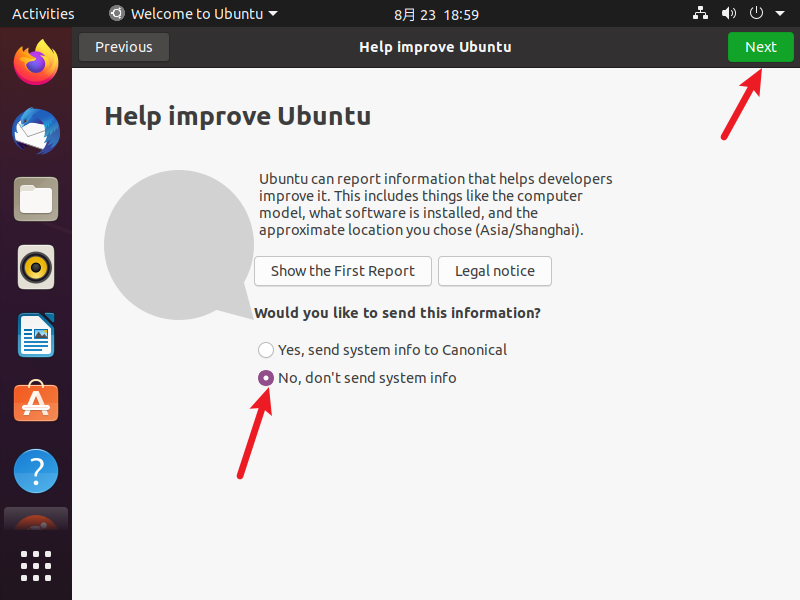

**背 景 简 介**
===========

  放了好久的 Ubuntu18.04 没打开使用，最近打开发现有些文件找不到路径，也懒得去找哪里错了，刚好最新的 Ubuntu20.04 已经出来了，干脆重新装一个最新版本的得了。

  话不多说，开干！

准备工作
====

*   Windows 10 专业版，64 位操作系统；
    
*   VMware15 Pro，版本：15.0.0 build-10134415；
    
*   Ubuntu 版本：ubuntu-20.04.1-desktop-amd64.iso
    

安装过程记录
======

*   打开 VMware15 软件，选择创建新的虚拟机；
    


*   默认选择自定义配置，下一步
    


*   虚拟机硬件兼容性，直接使用默认即可，然后下一步
    

 

*   选择：稍后安装操作系统，然后下一步
    

 

*   系统选择：Linux，Ubuntu 64 位，然后下一步
    

 

*   虚拟机名称可以根据自己需要修改，安装路径也可以自定义，不建议放 C 盘，然后下一步
    

 

*   处理器配置需要根据自己电脑实际情况，进行配置（PS：内核总数越多，可以加快编译速度，提高效率）。配置完成后点击下一步
    

 

*   虚拟机分配的内存，根据实际情况来，当然越大越好，系统运行速度什么的会更快。然后下一步
    


*   网络类型使用默认，然后下一步。（PS：如果后续想要给 Ubuntu 设置静态 IP 地址，可以参考：https://blog.csdn.net/Fighting_Boom/article/details/102755385
    


*   I/O 控制器类型，默认即可，下一步
    

 

*   磁盘类型，默认即可，下一步
    

 

*   选择磁盘：默认即可，下一步
    


*   磁盘大小，根据需要，不过由于这个是虚拟大小（虚拟大小：你给 Ubuntu 分配这么多内存，实际可能用不到这么多，会以实际使用的内存大小为准，虚拟大小就相当于一个上限），因此可以适当大一点也无所谓。
    
*   其他使用默认即可，下一步
    


*   文件名使用默认，路径与之前安装虚拟机的路径保持一致，然后下一步
    


*   都设置完成后，可以再确认一遍信息，有问题点击 “自定义硬件” 进行修改，若无问题，点击 “完成” 。
    


*   之后可以看到我们的虚拟机已经创建完成了
    

 

*   接下来需要告诉此虚拟机，使用的系统镜像是哪一个了，依次选择：编辑虚拟机设置 -> CD/DVD(SATA) -> 连接 -> 使用 ISO 映像文件 -> 浏览，选择之前我们下载好的 Ubuntu 镜像文件，完毕之后，点击确定
    

 

*   选择：开启此虚拟机，进行 Ubuntu 系统的安装，如下图，等待配置完成；
    


*   出现此界面，就可以正式开始安装了！根据需要，可以选择中文（简体），或者英文界面，我选择英文界面，然后点击安装 Ubuntu：Install Ubuntu
    


*   键盘布局使用默认的即可，然后继续：Continue
    


*   这一步第一个问题可以默认，即正常安装即可；
    
*   第二个问题，我都取消了勾选，暂不在安装时下载更新，也不下载其他第三方库，这样可以加快安装系统进度；还有一个就是，如果现在电脑没有联网，那就更不能选择在安装时下载更新了！
    
*   配置完成后，点击继续：Continue
    


*   这一步默认即可，然后选择现在安装：Install Now
    


*   是否要改写磁盘：默认，选择继续 Continue
    


*   时区选择上海，可以先点击地图，然后会有很多候选项， 找到 shanghai 这栏，选中即可，然后继续 Continue
    


*   设置用户名、计算机名、用户密码等，建议用户密码不要太复杂，后续要经常使用此密码，如果没啥特殊需要，尽量简单一点，方便后续使用。
    
*   我选择每次登录时都需要输入密码，然后确认配置信息无误后，点击继续 Continue
    


*   接下来就是正式的系统安装过程，不要乱动，等待系统自己完成安装；由于之前没有选择在安装时下载文件，此处安装过程应该不会很久，耐心等待即可。
    


*   点击图标，还能看到命令行的安装过程，此时我们发现他好像还是在联网下载某些文件，我选择 Skip ，跳过此步骤，更新可以在安装完之后更新，在安装过程中更新下载文件，会安装的很慢。
    


*   可以看到很快就安装完毕了，选择现在重启 Restart Now
    


*   此时提示我们：请删除安装介质，然后按 ENTER 键，这个时候我们需要去移除之前选择的系统镜像文件。此时发现，由于系统正在占用此镜像文件，无法移除，因此我选择先直接按下 Enter 键，进入系统界面；等后续配置完毕后，再移除镜像文件；
    
*   进入系统后，会出现这个界面，直接跳过，Skip
    

image-

*     


*   用户使用信息
    



*   定位信息，
    


*   发现可以安装的软件还挺多，
    

  


*   安装过程到这里就结束了，剩下的就是进行一个个性化的配置。
    

安装 VMware Tools
===============

  这个工具，可以帮我们做很多东西，比如 Ubuntu 界面全屏显示等，根据软件提示，进行操作；


*   点击 **安装 Tools** ，接着提示如下
    

 

*   找到左边的 **DVD** 选项，在文件夹内部右键，选择 **Open in Terminal** ，这个是在此处打开终端；
    


*   然后根据提示，使用 **tar** 解压缩安装程序，我使用如下命令
    

```
tar -zxvf <文件名>


```

*   但是貌似有错误，命令行错误如下
    

 

*   直接去文件夹，使用右键，选择 **Extract to** （提取到），我选择当前文件夹，
    


*   此时提示的错误就很明显了，告诉我没有足够的空间来提取文件；
    


*   好吧，那我换个提取路径，选择我提前建好的文件夹
    

```
tar -zxvf <文件名> -C /home/zhaoc/11-tools/11-VMware


```

*   通过命令行打印，以及去目标文件夹查看，可以看到提取成功
    

 

*   接着我们进到解压后的文件夹，查看当前文件有哪些，按照之前的提示，运行一个 **.pl** 的文件
    

 

*   我使用 **sudo** 命令，运行此文件，有如下提示，输入 **yes** ，然后回车继续此安装；可以看到之前没有使用 **sudo** 直接安装中断（失败）了；
    


*   接下来的提示，全部 **回车**，使用默认路径即可！
    


*   看到 **Enjoy** ，就说明安装成功了~
    


*   到这里 VMTools 就安装完毕了，有一个最大的好处就是，可以适应当前屏幕大小！大屏看着多舒服！
    


Ubuntu20.04 更换国内镜像源
===================

  一般安装好的系统，默认的镜像源都是国外的，使用起来速度很慢，接下来就尝试一种图形化的更换镜像源的方法！

*   找到设置，Settings
    


*   在左下角找到 **About** ，接着点击 **Software Updates** 
    


*   点击 **Download from** ，然后选中 **Other** ；
    


*   接着选择 **Select Best Server** ，这样系统就会选择一个最合适的镜像源，稍等片刻即可！
    


*   正在进行下载测试，可以看到下边的提示：正在进行一个服务测试，来找到最适合你的本地镜像服务器；
    


*   查找结束，我直接选择默认的
    

 

*   接着会提示输入密码，然后选择 **Authenticate** （认证）；
    


*   接着选择 **Close**
    


*   此时会提示，已经更新了镜像源，因此需要更新一下软件源列表啥的，按照提示正常操作就好；选择 **Reload** ，重新加载软件源列表；
    


*   等待加载完毕即可；
    
*   此时可以使用如下命令，进行软件的更新操作啦~
    

```
sudo apt-get update
sudo apt-get upgrade


```

*   有一个小建议，就是后续安装软件，可以使用 **aptitude** 进行安装，这个比 **apt-get** 的好处在于，可以自己帮忙解决一些软件的依赖问题，如果无法解决，也会给出很好的建议，由我们进行选择如何处理；
    
*   安装方法如下
    

```
sudo apt-get install aptitude


```

*   使用方法如下，只是把对应的 **apt-get** 替换为 **aptitude** 即可！
    

```
sudo aptitude install <软件名>


```

Ubuntu 系统备份
===========

  我们刚安装好的系统，为了避免后续玩崩溃，还是尽早做个备份！而 VMware 刚好就提供了一个叫做 **快照** 的功能，这个功能就相当于给当前的系统留下一个存档记录，后续如果有问题，可以随时恢复；

*   具体操作方法， 在这个地方，鼠标悬停，即可查看详细信息；
    
*   这三个从左到右依次为：拍摄此虚拟机的快照、将此虚拟机恢复到其父快照、管理此虚拟机的快照；
    


*   我们选择左边的，拍摄此虚拟机的快照；此时的操作，最好把所有打开的软件全部关闭，这样备份起来稍快一点；
    
*   接着我们填写对应的备份名称，以及相关的描述信息，即可点击 **拍摄快照** ，开始备份了！
    


*   在左下角可以看到当前保存的进度，如果系统很大，文件很多，相对就要慢一点。当然啦，跟电脑性能也是有关系滴~，耐心等待即可！
    


*   保存完的快照可以在最右边，**管理此虚拟机的快照** 中查看，后续有问题，直接回退即可，不需要再重新安装系统那么麻烦了！
    


总结
==

  整个的安装过程、个性化配置过程，到这里就结束了

--- _END_ ---