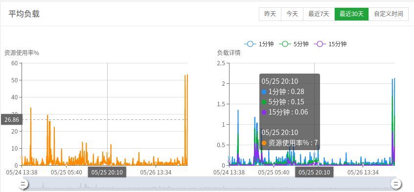
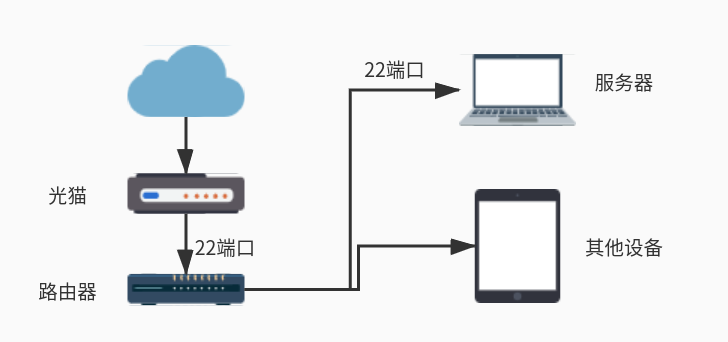
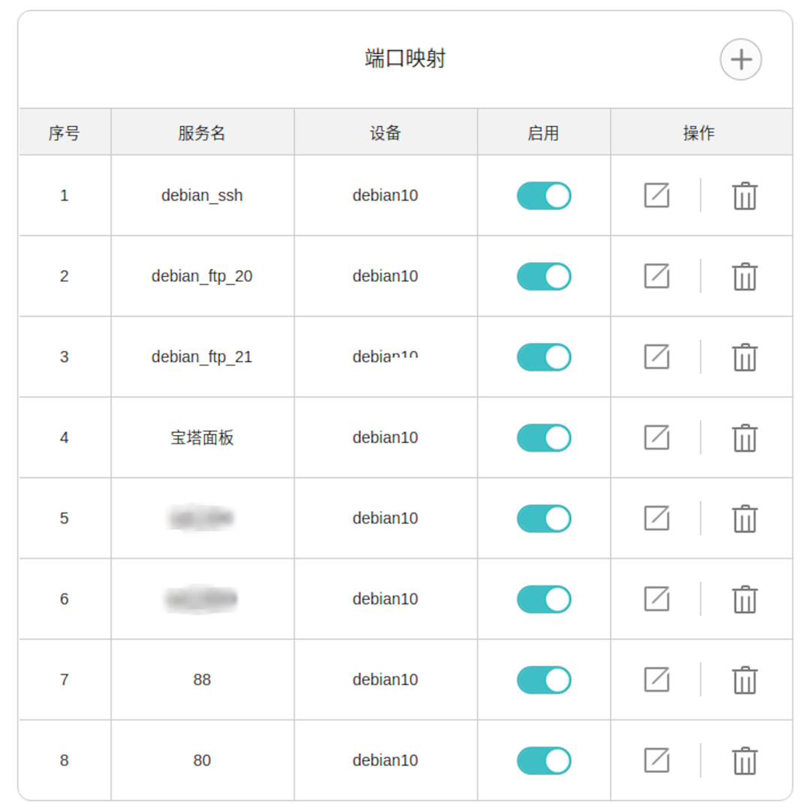

折腾一下
====

因为自己家里有一台很旧很旧的闲置笔记本，刚好听说电信的宽带可以免费申请到公网`ip`，同时家里的光猫和路由这次也从百兆换成了千兆，所以就想着搭建一套属于自己的云服务器放在家里，希望能够从外网访问自己搭建的服务，感觉会很爽！

所以本文主要聊一聊这个折腾和改造的过程。

基础条件
====

*   本文使用的是一台闲置的旧`ASUS`笔记本（奔腾双核`CPU`、`4G`内存、`360G`HDD)：安装`Linux`绰绰有余
    
*   家庭宽带，具有公网`IP`
    
*   有一个自己的域名（各大云厂商购买即可）
    
*   支持桥接模式的光猫、支持`NAT`和静态地址绑定的路由器（大多数都支持）
    

下面聊聊具体步骤。

服务器系统安装
=======

虽然这次实验所用的笔记本配置比较低了，但是因为作为一台个人服务器，其实性能还是很够用了的，这里选择安装的系统是`Linux`的`Debian10_64`位。

经过尝试发现真机安装`Debian`还是很舒服的，当然这里要吐槽的就是真机安装系统比虚拟机一般要麻烦那么一点。

> Debian 下载地址：www.debian.org/distrib

这里建议是下载小型安装镜像，因为即使下载了完整的`CD`镜像，实际上联网安装的话还是会建议你使用互联网镜像的，毕竟可以自己选择镜像源，下载起来其实还是挺快的。

安装的话这里建议先安装`GUI`，因为自己试了很多次，发现不安装`GUI`的话很多东西都缺失，到时候要么局域网都连不上，要么又是中文字体有问题（建议开始就不选择中文，直接选择英文），最后再卸载掉`GUI`以节省硬件资源和电费。同时设置笔记本盒盖不休眠，`CPU`调度模式改为保守。

宝塔面板 666
========

之前尝试过自己安装一些服务器环境必须的服务，结果到处踩坑，发现有点费劲了，最后还是用了宝塔面板，`Web`界面一键部署环境，比较省时省心。

安装宝塔面板非常简单，基本属于一键安装，可以参考：

> https://www.bt.cn/download/linux.html

宝塔面板除了一键部署环境外，还可以实施性能监控、计划任务、管理数据库、网站、FTP 服务，反正挺好用的，功能很强大。

路由 NAT 和服务器 DDNS 服务
===================

因为运营商给的公网`ip`并不是固定的，为了实现一直云访问服务器，需要`ddns`服务将本机当前公网`ip`解析到指定域名上。

但是通常路由器上自带的`ddns`服务基本上是花生壳，限速还不免费，所以这里采取服务器上解析的方案。

光猫改成桥接模式，路由器通过拨号方式来上网，然后路由器的防火墙是不能关的，所以要用`NAT`映射把访问端口做一个转换，例如访问路由器的`22`端口转到我们服务器的`22`端口来。

服务器上开启了什么端口，在路由器上就进行一次`NAT`转换。同时将服务器的`ip`进行静态地址绑定，使得服务器的局域网内地址不会再改变，确保前面的端口映射有效。

这样就实现了通过访问公网`ip`就能访问我的服务器了。当服务器上启动新的服务后，只需要在路由器上添加一个新的端口映射。

定时更新解析
======

这一步非常重要！需要定时更新公网`ip`并解析到指定域名的`ddns`服务。

这里用的是`github`上的一个`aliyun_ddns`开源项目，其通过阿里云给的`api`可以通过自己的程序进行域名解析。

> 项目地址为：github.com/limoxi/aliyun_ddns

修改项目中的相关信息后，运行这个项目中的`python`程序就可以实现一次获取本机的公网`ip`并解析到预设的域名

之前刚提到过宝塔面板可以执行计划任务，正好可以在宝塔中将这个程序设置为每`10min`自动运行一次（阿里云域名解析也是`10`分钟更新一次`DNS`缓存），这样就完事了。

至于为什么一定要用宝塔呢，其实无所谓，也可以自己在命令行手动设置，但是宝塔挺方便的，时间、脚本一键修改、日志一键查询，真的是不要太方便。

真香时刻
====

到此为止，基本上就完成了本地服务器上云的需求了。

通过智能排插，部署完上述服务后，监测到服务器的功率约为`25w`，`24`小时不停机运转一个月算下来才`18`度电，下行带宽可达`250M`，上行带宽`37M`，比起买腾讯云、阿里云的服务器等，成本更低的同时还能实现大得多的带宽、更大的内存和硬盘，岂不是美滋滋了。
