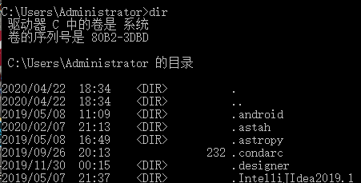
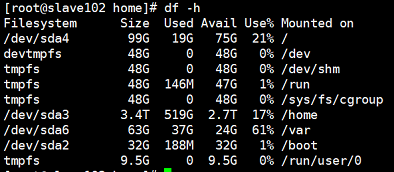

> 今天总结几个非常常用的 Linux 命令，其中有几个在面试中很可能问相关命令的原理，比如后台运行命令。希望对大家有所帮助，最好自己去尝试在 Linux 操作系统中实践一下。

1 查看目录以及权限  

-------------

> 在 windows 中，使用 dir 查看当前目录中文件。在 Linux 中使用 ls(list) 查看当前目录文件。

windows 中的 dir，如下图所示

> 在 Linux 中，通常使用 ls -l 列出，其中可以查看文件属性，所属用户组等较为详细的信息。下面详细解释从左到右每一列是什么意思

 ls -l

第一列第一个字段：文件类型，后面 9 个字符是模式，其中分为三组，每一组三个字段。第一组为所属用户权限。第二组为所属组的权限。第三组为其他用户所属权限。其中 r(read) 代表可读，w(write) 代表可写，e(execute) 代表可执行。在后面的 9 个字符中，如果是字母说明有相应的权限，如果为 "-" 代表没有权限。举一个例子

-rw-r-r--: 此为普通文件，对于所属用户为可读可写不能执行，对于所属组仅仅可读，对于其他用户仅为读。

第二列 硬链接数目

> 硬链接允许作用之一是允许一个文件拥有多个有效路径名，从而防止误删。但是只能在同一文件系统中的文件之间进行连接，不能对目录进行创建。

第三列是所属用户，第四列为所属组，第五列为文件大小，第六列为文件被修改的时间，最后为文件名。其中使用 chown 改变所属用户，chgrp 改变所属组。

2 nohup(no hang up 不要挂起的意思)
---------------------------

> 这也是常用后台启动程序的常用方法，如果在交互命令行中运行程序，我们很容易就终止它。在交互环境下，我们的输出一般都会直接输出到当前界面，在后台启动的时候通常会定向到文件，那通常情况是下面这个命令。

nohup command >X.file 2 >&1 &

> 其中 1 表示标准输出。2 表示文件标准错误输出。2>1& 即将两者合并，但是合并到哪里，就是 X.file.

3 查看进程
------

> 有的时候我们需要查看进程是否已经启动或者尝试终止进程。经常使用的命令为 ps -ef--- 列出当前正在运行的程序，那如何定位我们想要查看的进程 A，这个时候使用 grep，即 ps -ef| grep A.

4 awk
-----

> 如果文件是 csv(a.csv)，按照 "," 分割，需求为打印第一列和第二列

awk -F "," '{print 2}' a.csv

> 获取第三列最大值

awk 'BEGIN{max=0}{if(3}END{print max}'

5 tar 解压缩
---------

> 解压缩命令

常用参数

> -c: 创建的 tar 文件  
> -x: 解开 tar 文件  
> -t: 列出 tar 文件中包含的文件信息  
> -r：附加新的文件到 tar 文件中

常用命令组合

tar -xvf /home/a.tar  // 打开 tar 打包文件  
tar -zxvf /home/a.tar.gz // 解压以 gzip 压缩的文件  
tar -jxvf /home/a.tar.bz2 // 解压以 bzip 压缩的文件  
tar -cvf /home/a.tar /home 打包 / home 下所有文件

6 scp
-----

> 通过 scp 命令在多台服务器中的相互复制 传输文件。为了省下输入密码，可以设置免密登录。

常用组合：

例子 1：将 A 服务器中 / home/a.txt 复制到 B 服务器的 / home 中

scp -r /home/a.txt root@B_ip:/home

7 不敢用的命令 rm -rf
---------------

> 保持清醒，慎用！

8 watch
-------

> 这个命令是动态查看命令执行的结果。比如如果需要每隔一秒高亮显示网络连接数的变化情况。则 watch -n 1 -d netstat -ant

例子：每隔一秒高亮显示 http 连接数的变化情况

watch -n 1 -d 'pstree | grep http'

例子: 十秒一次输出系统的平均负载

watch -n 10 'cat /proc/loadavg'

9 df
----

> 查看磁盘大小

df -h

10 tcpdump
----------

> 和它类似的工具在 windows 中是 wireshark，其采用底层库 winpcap/libpcap 实现。采用了 bpf 过滤机制。下面我们看看提供的不同参数的含义。

<table width="677"><thead><tr><th width="99">参数名</th><th width="399.6666666666667">含义</th></tr></thead><tbody><tr><td width="99">-n</td><td width="399.6666666666667">使用 IP 地址表示主机。使用数字表示端口</td></tr><tr><td width="99">-i</td><td width="399.6666666666667">指定要监听的端口。如果为 "-i any" 表示住区所有网卡数据包</td></tr><tr><td width="99">-v</td><td width="399.6666666666667">输出诸如 ip 数据包中的 TTL 更加详细的信息</td></tr><tr><td width="99">-t</td><td width="399.6666666666667">不打印时间戳</td></tr><tr><td width="99">-e</td><td width="399.6666666666667">显示以太网帧头部信息</td></tr><tr><td width="99">-c</td><td width="399.6666666666667">仅仅抓取指定数量的数据包</td></tr><tr><td width="99">-x</td><td width="399.6666666666667">按照十六进制显示数据包内容</td></tr><tr><td width="126.66666666666667">-X</td><td width="399.6666666666667">不仅仅输出 - x 结果还输出十六进制对应的 ASCII 字符</td></tr><tr><td width="99">-s</td><td width="399.6666666666667">设置抓包时的抓包长度</td></tr><tr><td width="99">-w</td><td width="399.6666666666667">将输出结果定向到某个文件，一般为 pcap 后缀</td></tr><tr><td width="99">-r</td><td width="399.6666666666667">从文件读取数据包并显示数字表示端口</td></tr></tbody></table><table width="677"><tbody><tr><td width="134.66666666666666" height="8">-i </td><td width="410.6666666666667" height="8">指定要监听的端口。如果为 "-i any" 表示住区所有网卡数据包</td></tr><tr><td width="135.66666666666666">-v</td><td width="410.6666666666667">输出诸如 ip 数据包中的 TTL 更加详细的信息</td></tr><tr><td width="136.66666666666666">-t</td><td width="410.6666666666667">不打印时间戳</td></tr><tr><td width="136.66666666666666">-e</td><td width="410.6666666666667">显示以太网帧头部信息</td></tr><tr><td width="136.66666666666666">-c</td><td width="410.6666666666667">仅仅抓取指定数量的数据包</td></tr><tr><td width="136.66666666666666">-x</td><td width="410.6666666666667">按照十六进制显示数据包内容</td></tr><tr><td width="136.66666666666666">-X</td><td width="410.6666666666667">不仅仅输出 - x 结果还输出十六进制对应的 ASCII 字符</td></tr><tr><td width="136.66666666666666">-s</td><td width="410.6666666666667">设置抓包时的抓包长度</td></tr><tr><td width="136.66666666666666">-w</td><td width="410.6666666666667">将输出结果定向到某个文件，一般为 pcap 后缀</td></tr><tr><td width="136.66666666666666">-r</td><td width="410.6666666666667">从文件读取数据包并显示 </td></tr></tbody></table>

知道了相关参数，下面看几个案例

<table width="677"><thead><tr><th width="133">执行任务</th><th width="362.6666666666667">执行命令</th></tr></thead><tbody><tr><td width="163.66666666666666">捕获特定网口数据包</td><td width="362.6666666666667">tcpdump -i eth0</td></tr><tr><td width="133">捕获特定个数 (1000) 的包</td><td width="362.6666666666667">tcpdump -c 1000 -i eth0</td></tr><tr><td width="133">将捕获的包保存到文件</td><td width="362.6666666666667">tcpdump -w a.pcap -i eth0</td></tr><tr><td width="133">读取 pcap 格式的包</td><td width="362.6666666666667">tcpdump -r a.pcap</td></tr><tr><td width="133">增加捕获包的时间戳</td><td width="362.6666666666667">tcpdump -n -ttt -i eth0</td></tr><tr><td width="133">指定捕获包的协议类型</td><td width="362.6666666666667">tcpdump -i eth0 arp</td></tr><tr><td width="133">捕获指定端口</td><td width="362.6666666666667">tcpdump -i eth0 post 22</td></tr><tr><td width="133">捕获特定目标 ip+port 的包</td><td width="362.6666666666667">tcpdump -i eth0 dst address and port 22</td></tr><tr><td width="133">捕获 DNS 请求和响应</td><td width="362.6666666666667">tcpdump -i eth0 -s0 port 53</td></tr><tr><td width="133">匹配 Http 请求头</td><td width="362.6666666666667">tcpdump -s 0 -v -n -l | egrep -i "POST /|GET /|Host:"</td></tr></tbody></table><table width="677"><tbody><tr><td width="168.66666666666666">将捕获的包保存到文件</td><td width="561.6666666666667">tcpdump -w a.pcap -i eth0</td></tr><tr><td width="100.66666666666667">读取 pcap 格式的包</td><td width="403.6666666666667">tcpdump -r a.pcap</td></tr><tr><td width="110.66666666666667">增加捕获包的时间戳</td><td width="561.6666666666667">tcpdump -n -ttt -i eth0</td></tr><tr><td width="120.66666666666667">指定捕获包的协议类型</td><td width="561.6666666666667">tcpdump -i eth0 arp</td></tr><tr><td width="130.66666666666669">捕获指定端口</td><td width="561.6666666666667">tcpdump -i eth0 post 22</td></tr><tr><td width="140.66666666666669">捕获特定目标 ip+port 的包</td><td width="561.6666666666667">tcpdump -i eth0 dst address and port 22</td></tr><tr><td width="150.66666666666669">捕获 DNS 请求和响应</td><td width="561.6666666666667">tcpdump -i eth0 -s0 port 53</td></tr><tr><td width="160.66666666666669">匹配 Http 请求头</td><td width="561.6666666666667">tcpdump -s 0 -v -n -l | egrep -i "POST /|GET /|Host:"</td></tr></tbody></table>

11 lsof
-------

> 列出当前系统打开的文件描述符工具。可以得知感兴趣的描述符是被哪些进程使用

同样，我们看看相关参数

<table width="677"><thead><tr><th>参数</th><th width="181">描述</th></tr></thead><tbody><tr><td>-i</td><td width="489.6666666666667">显示 sokcet 文件描述符</td></tr><tr><td>-c</td><td width="181">显示指定的命令打开的所有文件描述符</td></tr><tr><td>-t</td><td width="181">仅显示打开了目标文件描述符的进程 pid</td></tr></tbody></table>

老规矩，上几个例子

<table width="677"><thead><tr><th width="126.99999999999999">执行任务</th><th width="361.6666666666667">命令</th></tr></thead><tbody><tr><td width="126.99999999999999">列出所有的网络链接</td><td width="361.6666666666667">lsof -i</td></tr><tr><td width="126.99999999999999">列出所有 udp 的网络链接</td><td width="361.6666666666667">lsof -i udp</td></tr><tr><td width="163.66666666666666">列出谁在使用某个端口</td><td width="361.6666666666667">lsof -i :3306</td></tr><tr><td width="126.99999999999999">列出谁在使用特定的 tcp 端口</td><td width="361.6666666666667">lsof -i tcp:80</td></tr><tr><td width="126.99999999999999">根据文件描述范围列出文件信息</td><td width="361.6666666666667">lsof -d 2-3</td></tr></tbody></table>

12 nc
-----

> nc-->“瑞士军刀”。不知大家在渗透过程中，拿了 shell 有没有使用 nc 搞点事儿。它用来快速构建网络链接。常用来调试客户端程序。

<table width="677"><thead><tr><th>参数</th><th width="94">描述</th></tr></thead><tbody><tr><td>-i</td><td width="489.6666666666667">设置数据包传送的时间间隔</td></tr><tr><td>-l</td><td width="94">以服务器方式运行。默认为客户端运行</td></tr><tr><td>-k</td><td width="94">重复接受并处理某个端口上的所有链接</td></tr><tr><td>-p</td><td width="94">以客户端运行时强制其使用指定端口</td></tr><tr><td>-C</td><td width="94">将 CR 和 LF 两个字符作为结束符</td></tr><tr><td>-u</td><td width="94">使用 udp 协议。默认 tcp 协议</td></tr><tr><td>-X</td><td width="94">nc 客户端余代理服务器通信时默认为 socks5 协议。</td></tr><tr><td>-z</td><td width="94">扫描目标机器某个范围服务是否开启</td></tr></tbody></table>

小贱上案例

<table width="677"><thead><tr><th width="216">执行任务</th><th width="279.6666666666667">执行命令</th></tr></thead><tbody><tr><td width="246.66666666666666">扫描机器 A 端口号在 30-40 的服务</td><td width="279.6666666666667">nc -z A 30-40</td></tr><tr><td width="216">连接服务器 A 端口号为 5000</td><td width="279.6666666666667">nc -C A 5000</td></tr><tr><td width="216">传送文件</td><td width="279.6666666666667">MachineA:nc -v -n ip port<d:\a.exe machineb:nc="" v="" l="" p="" port="">E:\a.exe</d:\a.exe></td></tr></tbody></table>

13 netstat
----------

> netstat 是一个网络信息统计工具。它可以得到网卡接口上全部了解，路由表信息，网卡接口信息等。通常在网络编程中我们用它来显示 TCP 连接以及状态信息。

<table width="677"><thead><tr><th>参数</th><th width="201">描述</th></tr></thead><tbody><tr><td>-n</td><td width="201">使用 IP 地址表示主机</td></tr><tr><td>-a</td><td width="201">显示结果中包含监听的 socket</td></tr><tr><td>-t</td><td width="201">仅显示 TCP 连接</td></tr><tr><td>-r</td><td width="201">显示路由信息</td></tr><tr><td>-i</td><td width="201">显示网卡接口数据流量</td></tr><tr><td>-c</td><td width="201">每隔 1s 输出一次</td></tr><tr><td>-o</td><td width="485.6666666666667">显示 socket 定时器的信息</td></tr><tr><td>-p</td><td width="201">显示 socket 所属的进程的 PID 和名字</td></tr></tbody></table>

下面列举几个常用例子

<table width="677"><thead><tr><th width="118.99999999999999">执行任务</th><th width="375.6666666666667">执行命令</th></tr></thead><tbody><tr><td width="118.99999999999999">列出所有连接</td><td width="375.6666666666667">netstat -a</td></tr><tr><td width="118.99999999999999">只列出 TCP 或者 UDP</td><td width="375.6666666666667">netstat -at/netstat -au</td></tr><tr><td width="118.99999999999999">列出监听中的连接</td><td width="375.6666666666667">netstat -tnl</td></tr><tr><td width="118.99999999999999">获取进程名、进程号以及用户 ID</td><td width="375.6666666666667">nestat &nbsp;-nlpt</td></tr><tr><td width="118.99999999999999">打印统计信息</td><td width="375.6666666666667">netstat -s</td></tr><tr><td width="118.99999999999999">netstat 持续输出</td><td width="375.6666666666667">netstat -ct</td></tr><tr><td width="150.66666666666666">打印 active 状态的连接</td><td width="375.6666666666667">netstat -atnp | grep ESTA</td></tr><tr><td width="118.99999999999999">查看服务是否运行 (npt)</td><td width="375.6666666666667">netstat -aple| grep ntp</td></tr></tbody></table>

14 vmstat
=========

> vmstat 能够实时输出系统的进程信息，内存使用，cpu 使用等资源的使用情况

<table width="677"><thead><tr><th>参数</th><th width="211">描述</th></tr></thead><tbody><tr><td>-f</td><td width="211">显示系统自启动以来执行的 fork 次数</td></tr><tr><td>-s</td><td width="211">显示内存相关统计信息</td></tr><tr><td>-d</td><td width="491.6666666666667">显示磁盘相关统计信息</td></tr><tr><td>-p</td><td width="211">显示指定磁盘分区统计信息</td></tr><tr><td>count</td><td width="211">采样次数。</td></tr></tbody></table>

看一下 vmstat 都有哪些输出字段。  

> 这里注意哈，如果查看磁盘的更加详细信息，有另外 iostat 所得到的信心就更加详细哟

15 mpstat
=========

> 能够实时监测多处理器系统中各个 cpu 的使用情况。这个命令的执行需要安装 sysstat，在 centos 中执行 yum install systat 就好了。

在这里插入图片描述

然后我们看看各个字段什么意思。

<table width="677"><thead><tr><th width="60">字段</th><th width="427.6666666666667">描述</th></tr></thead><tbody><tr><td width="60">cpu</td><td width="427.6666666666667">表示当前条信息属于哪个 cpu 的数据</td></tr><tr><td width="98.66666666666667">%usr</td><td width="427.6666666666667">进程运行在用户空间所占 cpu 运行时间的比例</td></tr><tr><td width="60">%nice</td><td width="427.6666666666667">nice 值为负的进程运行在用户空间的时间占 cpu 总运行时间的比例</td></tr><tr><td width="60">%iowait</td><td width="427.6666666666667">cpu 等待磁盘操作的时间占 cpu 总运行时间的比例</td></tr><tr><td width="60">%irq</td><td width="427.6666666666667">cpu 用于处理硬件中断时间占 cpu 总运行时间的比例</td></tr><tr><td width="60">%soft</td><td width="427.6666666666667">cpu 用于处理软件中断的时间占 cpu 用运行时间的比例</td></tr><tr><td width="60">%steal</td><td width="427.6666666666667">一对虚拟 cpu。当超级管理员在处理某个虚拟 cpu 时，另一个等待它处理完才能运行。这段等待时间表示为 steal 时间占总运行时间的比例</td></tr><tr><td width="60">%guest</td><td width="427.6666666666667">运行虚拟 cpu 时间占 cpu 总运行时间的比例</td></tr><tr><td width="60">%idle</td><td width="427.6666666666667">系统空闲时间占 cpu 总运行时间的比例</td></tr></tbody></table>

16 split
--------

> 将文件分割为数个。

split -5 a.txt// 将 a.txt 每 5 行分割为一个文件

17 wc -c +filename
------------------

> 统计文件中单词的个数。

18 more/less
------------

> 一页一页显示，通过空白键显示下一页 / 上一页

19 head/tail
------------

> 查看某文件前几行或者后几行

20 diff
-------

> diff -c file1 file2 // 显示两个文件的差异