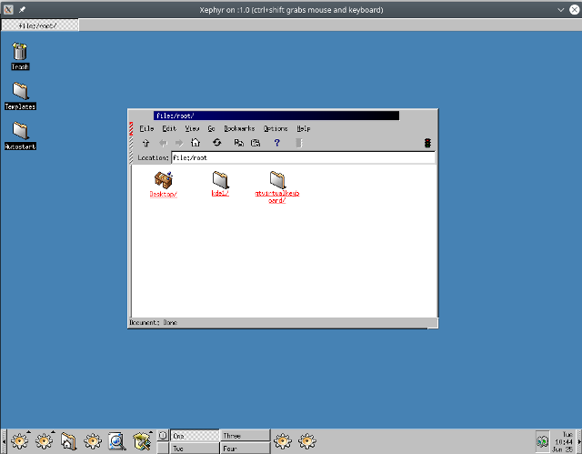
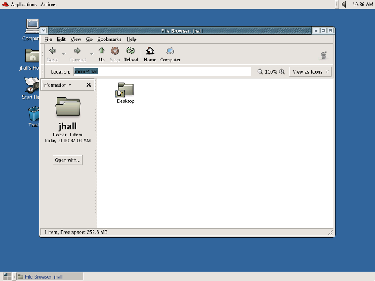

自 20 世纪 90 年代初期以来，Linux 桌面也已从简单的窗口管理器发展为成熟、完整的桌面。那么它究竟是如何一步步发展至今的呢？作为从 1993 年就开始使用 Linux 的资深用户，FreeDOS 创始人 Jim Hall 从初代窗口管理器开始，仔细梳理了一遍 Linux 桌面的进化史——  

#### **X 和窗口管理器**

Linux 上的第一个 “桌面” 是在 X Window 系统上运行的窗口管理器。X 为图形用户界面提供了基本构建块，例如在屏幕上创建窗口并提供键盘和鼠标输入。要运行 X 图形环境，用户需要一种方法来管理会话中的所有窗口，这就是窗口管理器的用武之地。运行像 xterm 或 xclock 这样的 X 程序，它们就会在窗口中打开。

窗口管理器负责跟踪窗口并执行基本的任务管理，例如移动窗口并最小化。剩下的则取决于个人，你可以在通过将 X 列在 ~/.xinitrc 文件中来启动程序，不过通常，用户会从 xterm 运行新程序。

1993 年最常见的窗口管理器是 TWM，它可以追溯至 1988 年。TWM 非常简单，只提供基本的窗口管理功能。

  
▲SLM 1.05 上的 TWM，图中为 xterm、xclock 和 Emacs 编辑器

另一个早期的窗口管理器是 OpenLook 虚拟窗口管理器（OLVWM）。OpenLook 是 Sun Microsystems 在 20 世纪 80 年代开发的图形用户界面，后来也被移植到其他 Unix 平台。作为虚拟窗口管理器，OLVWM 支持多个工作区。

  
▲SLS 1.05 上的 OLVWM，图为 xterm 和 Virtual Workspaces 选择器

当 Linux 开始普及时，创建一个具有流畅性能和改进界面的新窗口管理器并不需要花费很大力气。这些新窗口管理器中的首个便是 FVWM，一个虚拟窗口管理器。 FVWM 比 TWM 或 OLVWM 更具现代感。当然对于现代人来说，TWM 和 FVWM 可能看起来很平常。

  
▲SLS 1.05 上的 FVWM，图为 xterm 和文件管理器

当时的 Windows 桌面看起来相当简单。 Windows 版本 1 到 3 使用称为 “程序管理器” 的普通启动程序。

  
▲Windows 3.11 上的程序管理器和记事本编辑器

1995 年 8 月，微软发布了 Windows 95 并改变了现代 PC 桌面环境。在当时，Windows 3.x 看起来是笨拙而丑陋的，Windows 95 显然更为流畅好看。更重要的是，Windows 95 改变了人们对桌面的定义。

Windows 95 桌面意味着集成。程序管理器消失了，取而代之的是屏幕底部的任务栏，可以使用更简单的 “开始” 菜单启动新程序。与之前版本的 Windows 甚至其他 Linux 窗口管理器相比，Windows 95 界面更加灵活且易于使用。

  
▲Windows 95 上的记事本编辑器

Linux 开发人员不甘示弱，创建了一个模仿 Windows 95 界面的新版 FVWM，并称为 FVWM95。新的窗口管理器仍然不是桌面，但它看起来比以前好得多。用户可以在任务栏中使用 “开始” 菜单启动新的 X 程序，任务栏还使用类似于 Windows 95 的按钮显示正在运行的程序。

  
▲Red Hat Linux 5.2 上的 FVWM95

虽然 FVWM95 和其他窗口管理器在不断改进，但核心问题仍然存在：**Linux 并没有真正拥有桌面。****它只有一系列窗口管理器罢了**。

#### **首个 Linux 桌面**

1996 年，Matthias Ettrich 希望将所有内容集成在一起，就像一个真正的桌面一样。于是他开始研究 K 桌面环境（KDE），并于 1998 年 7 月完成。KDE 1.0 比 FVWM95 这样的普通窗口管理器有了明显的改进。

  
▲KDE 1.0

KDE 代表着 Linux 的一大进步，从此 Linux 拥有了真正的桌面应用程序集成和更现代的桌面图标。

KDE 的设计与 Windows 95 相差无几。它在屏幕底部有一个任务栏，提供了相当于 Windows 95 的开始菜单以及几个应用程序的快捷方式。此外，KDE 还支持虚拟桌面。

但并非所有人都对 KDE 感到满意。为了从系统中抽象 GUI，KDE 使用了 Trolltech 的 Qt 工具包库。不幸的是，Qt 没有在免费软件许可下发布。Trolltech 允许 Qt 在免费软件应用程序中免费使用，但在商业或专有应用程序中使用它需要付费。这使 Linux 发行版陷入两难抉择：应该包含 KDE 吗？或者默认使用较旧但免费的软件图形用户界面，如 FVWM？

很快，事情有了新的变化。Miguel de Icaza 和 Federico Mena 于 1997 年开始为新的 Linux 桌面工作。这个新项目被称为 GNOME，用于 GNU 网络对象模型环境。GNOME 旨在成为完全免费的软件，并使用来自 GIMP 图像编辑器的不同工具包，即 GTK（GIMP Tool Kit）。

当 GNOME 1.0 最终在 1999 年发布时，Linux 又拥有了一个现代桌面环境。

  
▲GNOME 1.0

此后，KDE 与 GNOME 的竞争持续了一段时间。转眼来到 1999 年，Trolltech 根据新的公共许可证——Q 公共许可证（QPL）重新发布了 Qt 库。但新许可证仍然有所限制，QPL 仅适用于 Qt 在开源软件项目中的使用，而非商业项目。因此，自由软件基金会认为 QPL 与 GNU 通用公共许可证（GNU GPL）不兼容。这个许可问题将一直持续到 Trolltech 在 2000 年 GNU GPL 第 2 版下重新发布 Qt 库。

#### **随着时间的发展**

Linux 桌面继续成熟。 KDE 和 GNOME 进入良性竞争状态，互相推动新的发展。到 2004 年，GNOME 和 KDE 都取得了重大进展，但只对用户界面进行了增量更改。

KDE 2 和 3 继续依赖于屏幕底部的任务栏概念，但包含了用于运行应用程序的按钮。KDE 最明显的变化之一是增加了 Konqueror 浏览器，它最初出现在 KDE 2 中。

  
▲KDE 2.2.2 （2001）

  
▲Fedora Core 2 上的 KDE 3.2.2（2004）

GNOME 2 也使用了任务栏概念，但它将栏分成两部分：屏幕顶部用于启动应用程序并响应桌面警报，页面底部显示正在运行的应用程序。除了简化的用户界面外，GNOME 还添加了一个名为 Nautilus 的文件管理器，由 Eazel 开发。

  
▲Fedora Core 2 上的 GNOME 2.6.0（2004）

随着时间的推移，KDE 和 GNOME 采取了不同的发展路径。两者都提供功能丰富、强大且现代化的桌面环境，但它们具有不同的用户界面目标。2011 年可以说是 GNOME 和 KDE 的分水岭。KDE 4.6（2011 年 1 月）和 KDE 4.7（2011 年 7 月）提供了更为传统的桌面，同时继续依赖许多用户熟悉的任务栏概念。从外观上来看，KDE 并没有什么太大的变化。

  
▲KDE 4.6

另一边的 GNOME 则在 2011 年通过新的桌面概念完全改变了方向。 GNOME 3 旨在创建更简化的桌面体验，使用户能够专注于他们正在进行的工作。任务栏消失，取而代之的是屏幕顶部的黑色状态栏，其中包括音量和网络控制，显示时间和电池状态，并允许用户通过重新设计的菜单启动新程序。

  
▲GNOME 3.0

#### **选择合适的桌面**

有人喜欢 KDE，有人喜欢 GNOME，选择最适合自己的就好。可以肯定的是，KDE 和 GNOME 都有批评者和支持者。这其中最著名的批评者也许是 Linus Torvalds，他在 2011 年大声谴责 GNOME 为 "unholy mess" 并放弃了它，两年后却又再度回归。

其他不少人对 GNOME 3 也提出了类似的批评，以至于一些开发人员将 GNOME 2 源代码分叉并创建 MATE 桌面。MATE 继承了 GNOME 2 的传统任务栏界面。

无论如何，毫无疑问，今天最流行的两个 Linux 桌面是 KDE 和 GNOME。它们目前的版本都非常成熟，并且功能丰富。KDE 5.16（2019）和 GNOME 3.32（2019）都试图简化 Linux 桌面体验，不过是以不同的方式。GNOME 3.32 继续瞄准最简洁的外观，删除所有令人分心的用户界面元素，以便用户可以专注于应用程序和工作。而 KDE 5.16 仍旧采用了较为熟悉的任务栏方法，但增加了其他视觉改进，特别是改进了图标和小部件处理。

  
▲KDE 5.6

  
▲GNOME 3.32

每个主要的 Linux 发行版都提供兼容性库，因此兼容性不会丢失，用户可以在 GNOME 上运行 KDE 应用程序，反之亦然。

KDE 和 GNOME 之间的良性竞争使两个阵营的开发人员都能够不断突破，这是一件好事。无论你使用的是 KDE 还是 GNOME，你都拥有一个集成度很高的现代化桌面。

最重要的是，这意味着 Linux 拥有自由软件中的最佳功能：选择。
