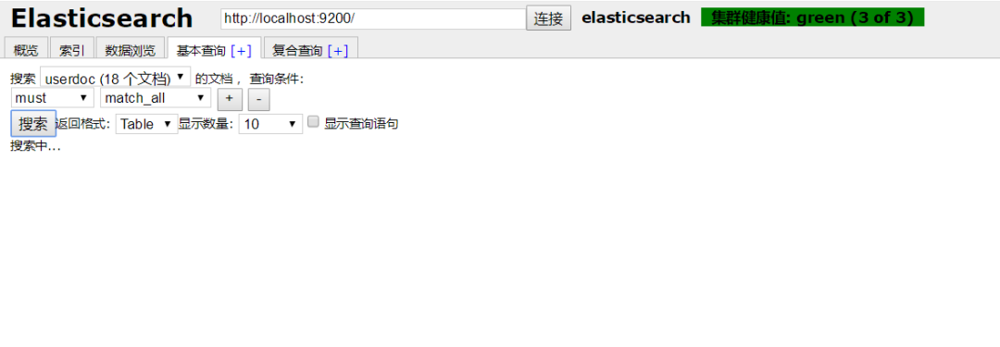

**概   述**

强大的搜索引擎 Elasticsearch 与传统关系型数据库的一个明显不同点在于 前者是一个非结构化的 NoSQL 数据库，因此里面的很多概念诸如索引、类型、文档等对于初学者可能会有些疑惑。有时候我们即使搭建好了 ES 集群，但数据存进去后到底是以一个什么形态存在，我们可能也疑惑重重，此时要是有个可视化的管理工具来辅助一下就便易于理解了，因此本文就搜罗了几种 Elasticsearch 可视化管理工具并一一体验一番。

> 本文内容脑图如下：


**elasticsearch-head**

*   **项目地址**：
    
    https://github.com/mobz/elasticsearch-head
    
*   **Docker 安装方式：**
    

```shell
docker run -d -p 9100:9100 docker.io/mobz/elasticsearch-head:5
```

*   **启动访问**：http://localhost:9100
    
*   **使用效果：**

（ 算了，这个简直上古时期的 UI 真心不想多看一眼，下面就凑合放两张图意思一下吧 ）




**ElasticHD**

ElasticHD 支持 ES 监控、实时搜索，Index template 快捷替换修改，索引列表信息查看， SQL converts to DSL 工具等，体验下来感觉还是比较强大的！

*   **项目地址：**
    
    https://github.com/360EntSecGroup-Skylar/ElasticHD
    
*   **直接安装方式：**
    

```shell
1. 首先下载zip压缩包：https://github.com/360EntSecGroup-Skylar/ElasticHD/releases/
2. 修改权限：chmod -R 777 ElasticHD
3. 运行: ./ElasticHD -p 127.0.0.1:9800 

```

*   **Docker 安装方式：**
    

```shell
docker run -p 9200:9200 -d --name elasticsearch elasticsearch
docker run -p 9800:9800 -d --link elasticsearch:demo containerize/elastichd

```

*   **启动访问**：http://localhost:9800
    
*   **使用效果：**
    

这个 Dashboard 有点酷炫：


数据搜索直观易使用：


索引列表看得比较清楚：


这个 SQL 查询语句转 ES 的 Json 查询格式的小工具挺厉害的：


**Dejavu**

Dejavu 也是一个 Elasticsearch 的 Web UI 工具，其 UI 界面更符合当下主流的前端页面风格，因此使用起来很方便。

*   **项目地址：**
    
    https://github.com/appbaseio/dejavu/
    
*   **Docker 安装方式：**
    

```shell
docker run -p 1358:1358 -d appbaseio/dejavu
```

*   **启动访问：**：http://localhost:1358/
    
*   **使用效果：**
    

这个数据预览页面非常直观，索引 / 类型 / 文档 看得一清二楚


查询功能也不错


好了，就抛砖引玉到这里了，大家可以根据自己的喜好进行深度体验！
