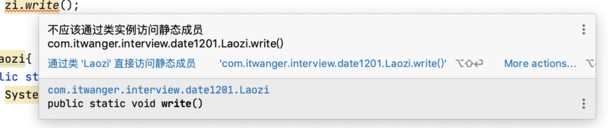
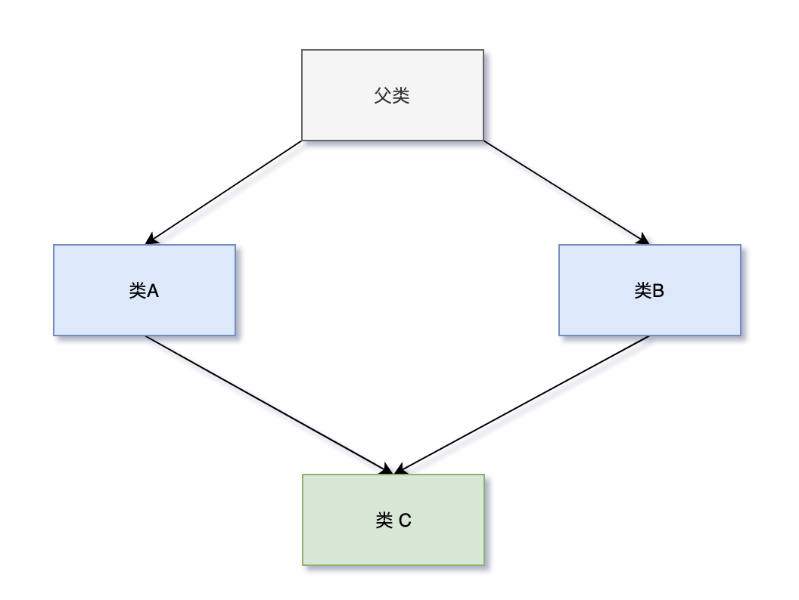
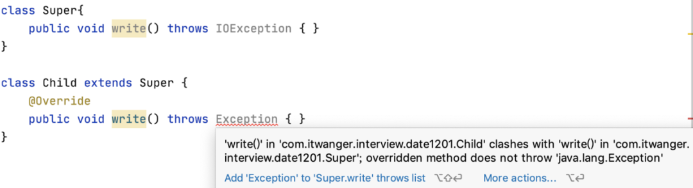
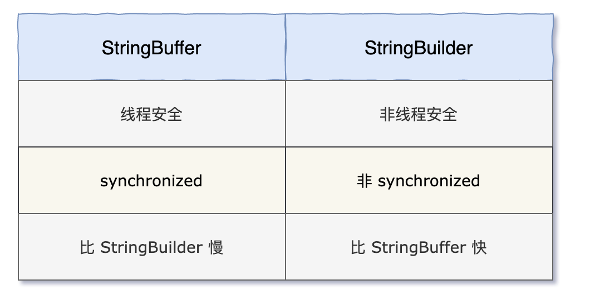

今天分享 10 道自查基础的 Java 面试题，这 10 道题整理自小伙伴小王的面试经历，他告诉我，他去一家公司面试 Java 岗，结果被面试官虐哭了。整整 10 道 Java 面试题，很多都不确定。  

借这个机会，把这 10 道面试题分享出来，希望能对其他小伙伴一些帮助。

**第一题，下面这串代码打印的结果是什么**

```
public class Test {
    public static void main(String[] args) {
        System.out.println(Math.min(Double.MIN_VALUE, 0.0d));
    }
}


```

小王之所以没答对这道题，是因为他觉得 Double.MIN_VALUE 和 Integer.MIN_VALUE 一样，是个负数，应该小于 0.0d。

但事实上，Double. MIN_VALUE 和 Double. MAX_VALUE 一样，都是正数，Double. MIN_VALUE 的值是 `2^(-1074)`，直接打印 Double. MIN_VALUE 的话，输出结果为 `4.9E-324`。

因此这道题的正确答案是输出 `0.0`。

**第二题，在 try 块或者 catch 语句中执行 return 语句或者 `System.exit()` 会发生什么，finally 语句还会执行吗？**

小王之所以没答对这道题，是因为在他的刻板印象中，finally 语句是无论如何都会执行的。

但事实上，在 try 块或者 catch 语句中执行 return 语句时，finally 语句会执行；在 try 块或者 catch 语句中执行 `System.exit()` 时，finally 语句不会执行。

```
public class Test1 {
    public static void main(String[] args) {
        returnTryExec();
        returnCatchExec();
        exitTryExec();
        exitCatchExec();
    }

    public static int returnTryExec() {
        try {
            return 0;
        } catch (Exception e) {
        } finally {
            System.out.println("finally returnTryExec");
            return -1;
        }
    }

    public static int returnCatchExec() {
        try { } catch (Exception e) {
            return 0;
        } finally {
            System.out.println("finally returnCatchExec");
            return -1;
        }
    }

    public static void exitTryExec() {
        try {
            System.exit(0);
        } catch (Exception e) {
        } finally {
            System.out.println("finally exitTryExec");
        }
    }

    public static void exitCatchExec() {
        try { } catch (Exception e) {
            System.exit(0);
        } finally {
            System.out.println("finally exitCatchExec");
        }
    }
}


```

程序执行结果如下所示：

```
finally returnTryExec
finally returnCatchExec


```

**第三题，私有方法或者静态方法能被重写（override）吗？**

小王之所以没答对这道题，是因为他不确定私有方法或者静态方法与重写之间的关系。

重写的两个方法名相同，方法参数的个数也相同；不过一个方法在父类中，另外一个在子类中。

```
class LaoWang{
    public void write() {
        System.out.println("老王写了一本《基督山伯爵》");
    }
}
class XiaoWang extends LaoWang {
    @Override
    public void write() {
        System.out.println("小王写了一本《茶花女》");
    }
}
public class OverridingTest {
    public static void main(String[] args) {
        LaoWang wang = new XiaoWang();
        wang.write();
    }
}


```

父类 LaoWang 有一个 `write()` 方法（无参），方法体是写一本《基督山伯爵》；子类 XiaoWang 重写了父类的 `write()` 方法（无参），但方法体是写一本《茶花女》。

在 main 方法中，我们声明了一个类型为 LaoWang 的变量 wang。在编译期间，编译器会检查 LaoWang 类是否包含了 `write()` 方法，发现 LaoWang 类有，于是编译通过。在运行期间，new 了一个 XiaoWang 对象，并将其赋值给 wang，此时 Java 虚拟机知道 wang 引用的是 XiaoWang 对象，所以调用的是子类 XiaoWang 中的 `write()` 方法而不是父类 LaoWang  中的 `write()` 方法，因此输出结果为 “小王写了一本《茶花女》”。

而私有方法对子类是不可见的，它仅在当前声明的类中可见，private 关键字满足了封装的最高级别要求。另外，Java 中的私有方法是通过编译期的静态绑定的方式绑定的，不依赖于特定引用变量所持有的对象类型。

方法重写适用于动态绑定，因此私有方法无法被重写。

```
class LaoWang{
    public LaoWang() {
        write();
        read();
    }
    public void write() {
        System.out.println("老王写了一本《基督山伯爵》");
    }

    private void read() {
        System.out.println("老王在读《哈姆雷特》");
    }
}
class XiaoWang extends LaoWang {
    @Override
    public void write() {
        System.out.println("小王写了一本《茶花女》");
    }

    private void read() {
        System.out.println("小王在读《威尼斯商人》");
    }
}
public class PrivateOrrideTest {
    public static void main(String[] args) {
        LaoWang wang = new XiaoWang();
    }
}


```

程序输出结果如下所示：

```
小王写了一本《茶花女》
老王在读《哈姆雷特》


```

在父类的构造方法中，分别调用了 `write()` 和 `read()` 方法，`write()`方法是 public 的，可以被重写，因此执行了子类的 `write()` 方法，`read()` 方法是私有的，无法被重写，因此执行的仍然是父类的 `read()` 方法。

和私有方法类似，静态方法在编译期也是通过静态绑定的方式绑定的，不依赖于特定引用变量所持有的对象类型。方法重写适用于动态绑定，因此静态方法无法被重写。

```
public class StaticOrrideTest {
    public static void main(String[] args) {
        Laozi zi = new Xiaozi();
        zi.write();
    }
}
class Laozi{
    public static void write() {
        System.out.println("老子写了一本《基督山伯爵》");
    }
}
class Xiaozi extends Laozi {
    public static void write() {
        System.out.println("小子写了一本《茶花女》");
    }
}


```

程序输出结果如下所示：

```
老子写了一本《基督山伯爵》


```

引用变量 zi 的类型为 Laozi，所以 `zi.write()` 执行的是父类中的 `write()` 方法。

静态方法也叫类方法，直接通过类名就可以调用，通过对象调用的时候，IDE 会发出警告。



**第四题，`1.0/0.0` 得到的结果是什么？会抛出异常吗，还是会出现编译错误？**

小王之所以没答对这道题，是因为他没有深入研究过 double 类型和 int 类型的除法运算。

数字在 Java 中可以分为两种，一种是整形，一种是浮点型。

当浮点数除以 0 的时候，结果为 Infinity 或者 NaN。

```
System.out.println(1.0 / 0.0); // Infinity
System.out.println(0.0 / 0.0); // NaN


```

Infinity 的中文意思是无穷大，NaN 的中文意思是这不是一个数字（Not a Number）。

当整数除以 0 的时候（`10 / 0`），会抛出异常：

```
Exception in thread "main" java.lang.ArithmeticException: / by zero
 at com.itwanger.eleven.ArithmeticOperator.main(ArithmeticOperator.java:32)


```

通常，我们在进行整数的除法运算时，需要先判断除数是否为 0，以免程序抛出异常。

**第五题，Java 支持多重继承吗？**

小王之所以没答对这道题，是因为他知道，通过接口可以达到多重继承的目的。

来定义两个接口，Fly 会飞，Run 会跑。

```
public interface Fly {
    void fly();
}
public interface Run {
    void run();
}


```

然后让一个类同时实现这两个接口。

```
public class Pig implements Fly,Run{
    @Override
    public void fly() {
        System.out.println("会飞的猪");
    }

    @Override
    public void run() {
        System.out.println("会跑的猪");
    }
}


```

但说到多重继承，讨论的关键字是 extends，而非 implements。

Java 只支持单一继承，是因为涉及到菱形问题。如果有两个类共同继承一个有特定方法的父类，那么该方法可能会被两个子类重写。然后，如果你决定同时继承这两个子类，那么在你调用该重写方法时，编译器不能识别你要调用哪个子类的方法。



类 C 同时继承了类 A 和类 B，类 C 的对象在调用类 A 和类 B 中重写的方法时，就不知道该调用类 A 的方法，还是类 B 的方法。

**第六题，当在 HashMap 中放入一个已经存在的 key 时，会发生什么？**

小王之所以没答对这道题，是因为他没有深入研究过 HashMap 的工作原理。

Hash，一般译作 “散列”，也有直接音译为“哈希” 的，这玩意什么意思呢？就是把任意长度的数据通过一种算法映射到固定长度的域上（散列值）。

再直观一点，就是对一串数据 wang 进行杂糅，输出另外一段固定长度的数据 er——作为数据 wang 的特征。我们通常用一串指纹来映射某一个人，别小瞧手指头那么大点的指纹，在你所处的范围内很难找出第二个和你相同的（人的散列算法也好厉害，有没有）。

对于任意两个不同的数据块，其散列值相同的可能性极小，也就是说，对于一个给定的数据块，找到和它散列值相同的数据块极为困难。再者，对于一个数据块，哪怕只改动它的一个比特位，其散列值的改动也会非常的大——这正是 Hash 存在的价值！

大家应该知道，HashMap 的底层数据结构是一个数组，通过 `hash()` 方法来确定下标。

```
static final int hash(Object key) {
    int h;
    return (key == null) ? 0 : (h = key.hashCode()) ^ (h >>> 16);
}


```

当我们放入一个键值对的时候，会先调用 `hash()` 方法对 key 进行哈希算法，如果 key 是相同的，那么哈希后的结果也是相同的，意味着数组中的下标是相同的，新放入的值就会覆盖原来的值。

**第七题，下面这段代码将会打印出什么？**

```
public class Test {
    public static void main(String[] args) {
        char[] chars = new char[]{'\u0097'};
        String str = new String(chars);
        byte[] bytes = str.getBytes();
        System.out.println(Arrays.toString(bytes));
    }
}


```

小王之所以没答对这道题，是因为他没有深入研究过字符编码方面的一些知识。

在这段程序中，我们通过一个字符数组创建了一个字符串对象，然后调用 String 类的 `getByte()` 方法得到字节数组并将其打印到控制台。

这道面试题考察的核心并不是最终的打印结果（结果是不确定的），而是字符编码。通常情况下，我们在调用 `getBytes()` 方法时，要指定编码，比如说 `str.getBytes(StandardCharsets.UTF_8)`。

当我们没有指定编码的时候，JDK 会调用平台默认的字符编码，而不同的操作系统，编码不尽相同的，bytes 的结果也就会不同。

当使用 UTF_8 时，结果为 `-62, -105`，当使用 GB2312 时，结果为 `63`。

**第八题，当方法在父类中抛出 `NullPointerException` 时，是否可以使用抛出 `RuntimeException` 的方法来重写它？**

小王之所以没答对这道题，是因为他被重写（overriding）和重载（overloading）的概念搞混了。

方法重写和方法重载时，方法名可以完全相同，但根本的不同在于方法重写时发生在运行时，方法重载时发生在编译时。

另外，方法重写和方法重载时的规则也不尽相同。在 Java 中，不能重写 private、static 和 final 方法，但可以重载它们。

我们来重点看一下方法重写时的规则：

1）方法签名必须相同，包括返回类型、参数的数量、参数的类型和参数的顺序。

2）重写后的方法不能抛出比父类中更高级别的异常。举例来说，如果父类中的方法抛出的是 IOException，那么子类中重写的方法不能抛出 Exception，可以是 IOException 的子类或者不抛出任何异常。这条规则只适用于可检查的异常。

可检查（checked）异常必须在源代码中显式地进行捕获处理，不检查（unchecked）异常就是所谓的运行时异常，比如说 NullPointerException、ArrayIndexOutOfBoundsException 之类的，不会在编译器强制要求。

3）重写后的方法访问权限不能比父类中的方法低，比如说父类中的方法是 public，重写后的方法就不能是 protected。

```
public class ExceptionDemo {
    public static void main(String[] args) {
        Super s = new Child();
        s.write();
    }
}
class Super{
    public void write() throws NullPointerException { }
}

class Child extends Super {
    @Override
    public void write() throws RuntimeException { }
}


```

RuntimeException 和 NullPointerException 属于不检查异常，所以本题的答案是可以的。如果是可检查异常的话，IDE 就会发出警告。



**第九题，下面这段代码使用了 `compareTo()` 方法，有问题吗？**

```
class Employee implements Comparable {
    private int id;

    @Override
    public int compareTo(Object o) {
        Employee emp = (Employee) o;
        return this.id - emp.id;
    }
}


```

小王之所以没答对这道题，是因为他想当然地认为 id 的都是正整数。

当我们需要按照一定的规则进行排序的时候，通常要实现 Comparable 接口，并实现 compareTo 方法，规则如下：

1）如果当前对象小于另外一个对象，则 compareTo 方法必须返回负数；如果当前对象大于另外一个对象，则必须返回正数；如果两个对象相等，则返回零。

2）通常来说，compareTo 方法必须和 equals 方法一致，如果两个对象通过 equals 方法判断的结果为 true，那么 compareTo 必须返回零。

不过，JDK 中有一个反例，就是 BigDecimal。

```
BigDecimal bd1 = new BigDecimal("2.0");
BigDecimal bd2 = new BigDecimal("2.00");

System.out.println("equals: " + bd1.equals(bd2));
System.out.println("compareTo: " + bd1.compareTo(bd2));


```

输出结果如下所示：

```
equals: false
compareTo: 0


```

这是因为 JDK 认为 2.0 和 2.00 的精度不一样，所以不能 equals，但值确实是相等的。

3）不能使用减法来比较整数值，因为减法的结果可能溢出。应该使用 `Integer.compareTo()` 来进行比较。如果你想通过减法操作来提高性能，必须得确保两个操作数是正整数，或者确保两者相差的值小于 Integer.MAX_VALUE。

```
public class CompareDemo {
    public static void main(String[] args) {
        List<Employee> list = new ArrayList<>();
        list.add(new Employee(1));
        list.add(new Employee(Integer.MIN_VALUE));
        list.add(new Employee(Integer.MAX_VALUE));
        Collections.sort(list);
        System.out.println(list);
    }
}

class Employee implements Comparable {
    private int id;

    public Employee(int id) {
        this.id = id;
    }

    @Override
    public int compareTo(Object o) {
        Employee emp = (Employee) o;
        return this.id - emp.id;
    }

    @Override
    public String toString() {
        return "Employee{" +
                "id=" + id +
                '}';
    }
}


```

程序的输出结果如下所示：

```
[Employee{id=1}, Employee{id=2147483647}, Employee{id=-2147483648}]


```

排序就乱了。因为 `Integer.MIN_VALUE - 1` 变成了正数 `2147483647`。

**第十题，StringBuffer 和 StringBuilder 之间有什么区别？**

小王之所以没答对这道题，是因为他觉得这道题太简单了，结果说反了，大意了啊。

StringBuilder 是 JDK 1.5 之后引入的，它和 StringBuffer 最大的区别就在于它的一系列方法都是非同步的。


