### 1. Arraylist 与 LinkedList 区别

可以从它们的底层数据结构、效率、开销进行阐述哈

*   ArrayList 是数组的数据结构，LinkedList 是链表的数据结构。
    
*   随机访问的时候，ArrayList 的效率比较高，因为 LinkedList 要移动指针，而 ArrayList 是基于索引 (index) 的数据结构，可以直接映射到。
    
*   插入、删除数据时，LinkedList 的效率比较高，因为 ArrayList 要移动数据。
    
*   LinkedList 比 ArrayList 开销更大，因为 LinkedList 的节点除了存储数据，还需要存储引用。
    

### 2. Collections.sort 和 Arrays.sort 的实现原理

Collection.sort 是对 list 进行排序，Arrays.sort 是对数组进行排序。

#### Collections.sort 底层实现

Collections.sort 方法调用了 list.sort 方法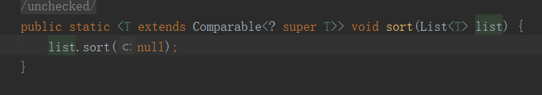 list.sort 方法调用了 Arrays.sort 的方法因此，**Collections.sort 方法底层就是调用的 Array.sort 方法**

#### Arrays.sort 底层实现

Arrays 的 sort 方法，如下：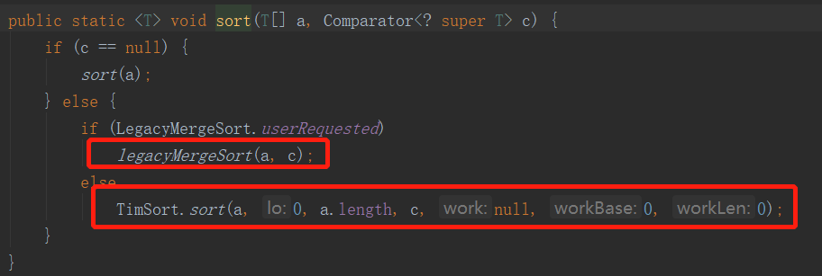如果比较器为 null，进入 sort（a）方法。如下：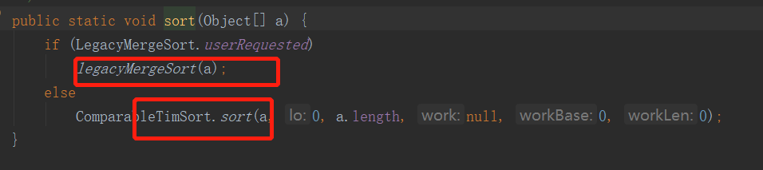因此，Arrays 的 sort 方法底层就是：

*   legacyMergeSort(a)，归并排序，
    
*   ComparableTimSort.sort()：即 Timsort 排序。
    

#### Timesort 排序

Timsort 排序是结合了合并排序（merge.sort）和插入排序（insertion sort）而得出的排序方法；

1. 当数组长度小于某个值，采用的是二分插入排序算法，如下：

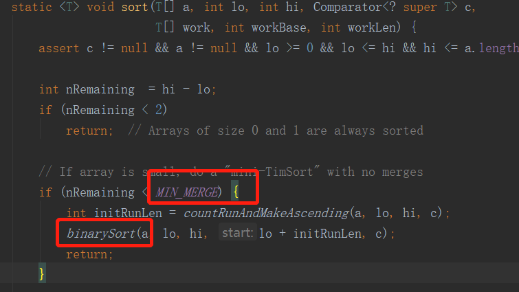

2.  找到各个 run，并入栈。
    

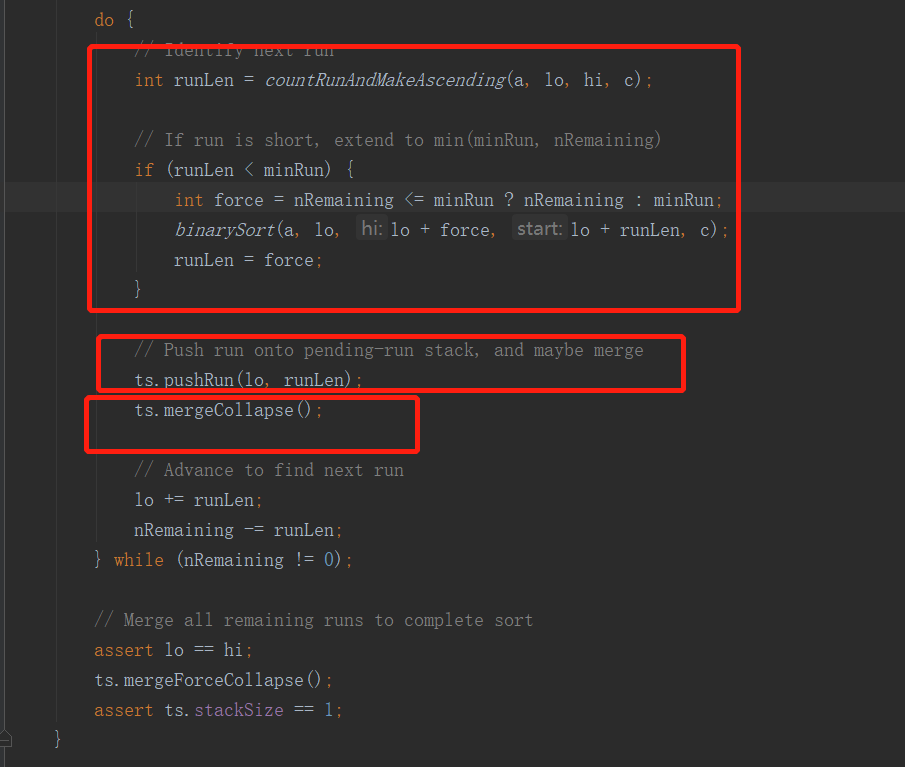

3.  按规则合并 run。
    

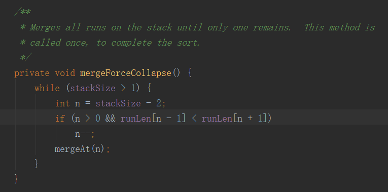

### 3. HashMap 原理，java8 做了什么改变

*   HashMap 是以键值对存储数据的集合容器
    
*   HashMap 是非线性安全的。
    
*   HashMap 底层数据结构：数组 +(链表、红黑树)，jdk8 之前是用数组 + 链表的方式实现，jdk8 引进了红黑树
    
*   Hashmap 数组的默认初始长度是 16，key 和 value 都允许 null 的存在
    
*   HashMap 的内部实现数组是 Node[] 数组，上面存放的是 key-value 键值对的节点。HashMap 通过 put 和 get 方法存储和获取。
    
*   HashMap 的 put 方法，首先计算 key 的 hashcode 值，定位到对应的数组索引，然后再在该索引的单向链表上进行循环遍历，用 equals 比较 key 是否存在，如果存在则用新的 value 覆盖原值，如果没有则向后追加。
    
*   jdk8 中 put 方法：先判断 Hashmap 是否为空，为空就扩容，不为空计算出 key 的 hash 值 i，然后看 table[i] 是否为空，为空就直接插入，不为空判断当前位置的 key 和 table[i] 是否相同，相同就覆盖，不相同就查看 table[i] 是否是红黑树节点，如果是的话就用红黑树直接插入键值对，如果不是开始遍历链表插入，如果遇到重复值就覆盖，否则直接插入，如果链表长度大于 8，转为红黑树结构，执行完成后看 size 是否大于阈值 threshold，大于就扩容，否则直接结束。
    
*   Hashmap 解决 hash 冲突，使用的是链地址法，即数组 + 链表的形式来解决。put 执行首先判断 table[i] 位置，如果为空就直接插入，不为空判断和当前值是否相等，相等就覆盖，如果不相等的话，判断是否是红黑树节点，如果不是，就从 table[i] 位置开始遍历链表，相等覆盖，不相等插入。
    
*   HashMap 的 get 方法就是计算出要获取元素的 hash 值，去对应位置获取即可。
    
*   HashMap 的扩容机制，Hashmap 的扩容中主要进行两步，第一步把数组长度变为原来的两倍，第二部把旧数组的元素重新计算 hash 插入到新数组中，jdk8 时，不用重新计算 hash，只用看看原来的 hash 值新增的一位是零还是 1，如果是 1 这个元素在新数组中的位置，是原数组的位置加原数组长度，如果是零就插入到原数组中。扩容过程第二部一个非常重要的方法是 transfer 方法，采用头插法，把旧数组的元素插入到新数组中。
    
*   HashMap 大小为什么是 2 的幂次方？效率高 + 空间分布均匀
    

### 4. List 和 Set，Map 的区别

*   List 以索引来存取元素，有序的，元素是允许重复的，可以插入多个 null。
    
*   Set 不能存放重复元素，无序的，只允许一个 null
    
*   Map 保存键值对映射，映射关系可以一对一、多对一
    
*   List 有基于数组、链表实现两种方式
    
*   Set、Map 容器有基于哈希存储和红黑树两种方式实现
    
*   Set 基于 Map 实现，Set 里的元素值就是 Map 的键值
    

### 5. poll() 方法和 remove() 方法的区别？

Queue 队列中，poll() 和 remove() 都是从队列中取出一个元素，在队列元素为空的情况下，remove() 方法会抛出异常，poll() 方法只会返回 null 。

看一下源码的解释吧：

```
 /**
     * Retrieves and removes the head of this queue.  This method differs
     * from {@link #poll poll} only in that it throws an exception if this
     * queue is empty.
     *
     * @return the head of this queue
     * @throws NoSuchElementException if this queue is empty
     */
    E remove();
        /**
     * Retrieves and removes the head of this queue,
     * or returns {@code null} if this queue is empty.
     *
     * @return the head of this queue, or {@code null} if this queue is empty
     */
    E poll();

```

### 6. HashMap，HashTable，ConcurrentHash 的共同点和区别

**HashMap**

*   底层由链表 + 数组 + 红黑树实现
    
*   可以存储 null 键和 null 值
    
*   线性不安全
    
*   初始容量为 16，扩容每次都是 2 的 n 次幂
    
*   加载因子为 0.75，当 Map 中元素总数超过 Entry 数组的 0.75，触发扩容操作.
    
*   并发情况下，HashMap 进行 put 操作会引起死循环，导致 CPU 利用率接近 100%
    
*   HashMap 是对 Map 接口的实现
    

**HashTable**

*   HashTable 的底层也是由链表 + 数组 + 红黑树实现。
    
*   无论 key 还是 value 都不能为 null
    
*   它是线性安全的，使用了 synchronized 关键字。
    
*   HashTable 实现了 Map 接口和 Dictionary 抽象类
    
*   Hashtable 初始容量为 11
    

**ConcurrentHashMap**

*   ConcurrentHashMap 的底层是数组 + 链表 + 红黑树
    
*   不能存储 null 键和值
    
*   ConcurrentHashMap 是线程安全的
    
*   ConcurrentHashMap 使用锁分段技术确保线性安全
    
*   JDK8 为何又放弃分段锁，是因为多个分段锁浪费内存空间，竞争同一个锁的概率非常小，分段锁反而会造成效率低。
    

### 7. 写一段代码在遍历 ArrayList 时移除一个元素

因为 foreach 删除会导致快速失败问题，fori 顺序遍历会导致重复元素没删除，所以正确解法如下：

第一种遍历，倒叙遍历删除

```
for(int i=list.size()-1; i>-1; i--){
  if(list.get(i).equals("jay")){
    list.remove(list.get(i));
  }
}

```

第二种，迭代器删除

```
Iterator itr = list.iterator();
while(itr.hasNext()) {
      if(itr.next().equals("jay") {
        itr.remove();
      }
}

```

### 8. Java 中怎么打印数组？

数组是不能直接打印的哈，如下:

```
public class Test {
    public static void main(String[] args) {
        String[] jayArray = {"jay", "boy"};
        System.out.println(jayArray);
    }
}
//output
[Ljava.lang.String;@1540e19d

```

打印数组可以用流的方式 Strem.of().foreach()，如下:

```
public class Test {
    public static void main(String[] args) {
        String[] jayArray = {"jay", "boy"};
        Stream.of(jayArray).forEach(System.out::println);
    }
}
//output
jay
boy

```

打印数组，最优雅的方式可以用这个 APi,Arrays.toString()

```
public class Test {
    public static void main(String[] args) {
        String[] jayArray = {"jay", "boy"};
        System.out.println(Arrays.toString(jayArray));
    }
}
//output
[jay, boy]

```

### 9. TreeMap 底层？

*   TreeMap 实现了 SotredMap 接口，它是有序的集合。
    
*   TreeMap 底层数据结构是一个红黑树，每个 key-value 都作为一个红黑树的节点。
    
*   如果在调用 TreeMap 的构造函数时没有指定比较器，则根据 key 执行自然排序。
    

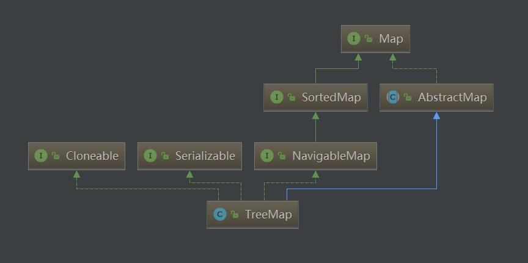

### 10. HashMap 的扩容过程

Hashmap 的扩容：

*   第一步把数组长度变为原来的两倍，
    
*   第二步把旧数组的元素重新计算 hash 插入到新数组中。
    
*   jdk8 时，不用重新计算 hash，只用看看原来的 hash 值新增的一位是零还是 1，如果是 1 这个元素在新数组中的位置，是原数组的位置加原数组长度，如果是零就插入到原数组中。扩容过程第二步一个非常重要的方法是 transfer 方法，采用头插法，把旧数组的元素插入到新数组中。
    

### 11. HashSet 是如何保证不重复的

可以看一下 HashSet 的 add 方法，元素 E 作为 HashMap 的 key，我们都知道 HashMap 的可以是不允许重复的，哈哈。

```
 public boolean add(E e) {
    return map.put(e, PRESENT)==null;
}

```

### 12. HashMap 是线程安全的吗，为什么不是线程安全的？死循环问题？

不是线性安全的。

并发的情况下，扩容可能导致死循环问题。

### 13. LinkedHashMap 的应用，底层，原理

*   LinkedHashMap 维护着一个运行于所有条目的双重链接列表。此链接列表定义了迭代顺序，该迭代顺序可以是插入顺序（insert-order）或者是访问顺序，其中默认的迭代访问顺序就是插入顺序，即可以按插入的顺序遍历元素，这点和 HashMap 有很大的不同。
    
*   LRU 算法可以用 LinkedHashMap 实现。
    

### 14. 哪些集合类是线程安全的？哪些不安全？

线性安全的

*   Vector：比 Arraylist 多了个同步化机制。
    
*   Hashtable：比 Hashmap 多了个线程安全。
    
*   ConcurrentHashMap: 是一种高效但是线程安全的集合。
    
*   Stack：栈，也是线程安全的，继承于 Vector。
    

线性不安全的

*   Hashmap
    
*   Arraylist
    
*   LinkedList
    
*   HashSet
    
*   TreeSet
    
*   TreeMap
    

### 15. ArrayList 和 Vector 的区别是什么？

*   Vector 是线程安全的，ArrayList 不是线程安全的。
    
*   ArrayList 在底层数组不够用时在原来的基础上扩展 0.5 倍，Vector 是扩展 1 倍。
    
*   Vector 只要是关键性的操作，方法前面都加了 synchronized 关键字，来保证线程的安全性。
    

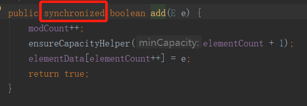

### 16. Collection 与 Collections 的区别是什么？

*   Collection 是 Java 集合框架中的基本接口，如 List 接口也是继承于它
    

```
public interface List<E> extends Collection<E> {

```

*   Collections 是 Java 集合框架提供的一个工具类，其中包含了大量用于操作或返回集合的静态方法。如下：
    

```
public static <T extends Comparable<? super T>> void sort(List<T> list) {
    list.sort(null);
}

```

### 17. 如何决定使用 HashMap 还是 TreeMap？

这个点，主要考察 HashMap 和 TreeMap 的区别。

TreeMap 实现 SortMap 接口，能够把它保存的记录根据键排序，默认是按 key 的升序排序，也可以指定排序的比较器。当用 Iterator 遍历 TreeMap 时，得到的记录是排过序的。

### 18. 如何实现数组和 List 之间的转换？

#### List 转 Array

List 转 Array，必须使用集合的 toArray(T[] array)，如下：

```
List<String> list = new ArrayList<String>();
list.add("jay");
list.add("tianluo");
// 使用泛型，无需显式类型转换
String[] array = list.toArray(new String[list.size()]);
System.out.println(array[0]);

```

如果直接使用 toArray 无参方法，返回值只能是 Object[] 类，强转其他类型可能有问题，demo 如下：

```
List<String> list = new ArrayList<String>();
list.add("jay");
list.add("tianluo");
String[] array = (String[]) list.toArray();
System.out.println(array[0]);

```

运行结果：

```
Exception in thread "main" java.lang.ClassCastException: [Ljava.lang.Object; cannot be cast to [Ljava.lang.String;
	at Test.main(Test.java:14)

```

#### Array 转 List

使用 Arrays.asList() 把数组转换成集合时，不能使用修改集合相关的方法啦，如下：

```
String[] str = new String[] { "jay", "tianluo" };
List list = Arrays.asList(str);
list.add("boy");

```

运行结果如下：

```
Exception in thread "main" java.lang.UnsupportedOperationException
	at java.util.AbstractList.add(AbstractList.java:148)
	at java.util.AbstractList.add(AbstractList.java:108)
	at Test.main(Test.java:13)

```

因为 Arrays.asList 不是返回 java.util.ArrayList, 而是一个内部类 ArrayList。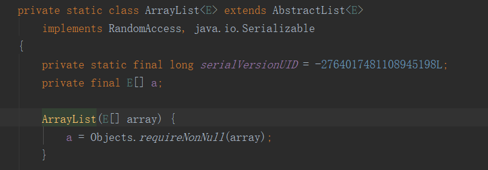

可以这样使用弥补这个缺点：

```
//方式一：
ArrayList< String> arrayList = new ArrayList<String>(strArray.length);
Collections.addAll(arrayList, strArray);
//方式二：
ArrayList<String> list = new ArrayList<String>(Arrays.asList(strArray)) ;

```

### 19. 迭代器 Iterator 是什么？怎么用，有什么特点？

```
public interface Collection<E> extends Iterable<E> {
Iterator<E> iterator();

```

方法如下：

```
next() 方法获得集合中的下一个元素
hasNext() 检查集合中是否还有元素
remove() 方法将迭代器新返回的元素删除
forEachRemaining(Consumer<? super E> action) 方法，遍历所有元素

```

Iterator 主要是用来遍历集合用的，它的特点是更加安全，因为它可以确保，在当前遍历的集合元素被更改的时候，就会抛出 ConcurrentModificationException 异常。

使用 demo 如下：

```
List<String> list = new ArrayList<>();
Iterator<String> it = list. iterator();
while(it. hasNext()){
  String obj = it. next();
  System. out. println(obj);
}

```

### 20. Iterator 和 ListIterator 有什么区别？

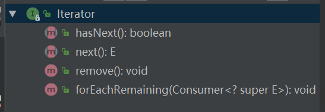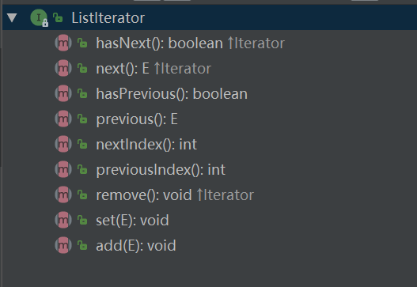

*   ListIterator 比 Iterator 有更多的方法。
    
*   ListIterator 只能用于遍历 List 及其子类，Iterator 可用来遍历所有集合，
    
*   ListIterator 遍历可以是逆向的，因为有 previous() 和 hasPrevious() 方法，而 Iterator 不可以。
    
*   ListIterator 有 add() 方法，可以向 List 添加对象，而 Iterator 却不能。
    
*   ListIterator 可以定位当前的索引位置，因为有 nextIndex() 和 previousIndex() 方法，而 Iterator 不可以。
    
*   ListIterator 可以实现对象的修改，set() 方法可以实现。Iierator 仅能遍历，不能修改哦。
    

### 21. 怎么确保一个集合不能被修改？

很多朋友很可能想到用 final 关键字进行修饰，final 修饰的这个成员变量，如果是基本数据类型，表示这个变量的值是不可改变的，如果是引用类型，则表示这个引用的地址值是不能改变的，但是这个引用所指向的对象里面的内容还是可以改变滴~ 验证一下，如下：

```
public class Test {
    //final 修饰
    private static final Map<Integer, String> map = new HashMap<Integer, String>();
    {
        map.put(1, "jay");
        map.put(2, "tianluo");
    }
    public static void main(String[] args) {
        map.put(1, "boy");
        System.out.println(map.get(1));
    }
}

```

运行结果如下:

```
//可以洗发现，final修饰，集合还是会被修改呢
boy

```

嘻嘻，那么，到底怎么确保一个集合不能被修改呢，看以下这三哥们~

*   unmodifiableMap
    
*   unmodifiableList
    
*   unmodifiableSet
    

再看一下 demo 吧

```
public class Test {
    private static  Map<Integer, String> map = new HashMap<Integer, String>();
    {
        map.put(1, "jay");
        map.put(2, "tianluo");
    }
    public static void main(String[] args) {
        map = Collections.unmodifiableMap(map);
        map.put(1, "boy");
        System.out.println(map.get(1));
    }
}

```

运行结果：

```
// 可以发现，unmodifiableMap确保集合不能修改啦，抛异常了
Exception in thread "main" java.lang.UnsupportedOperationException
	at java.util.Collections$UnmodifiableMap.put(Collections.java:1457)
	at Test.main(Test.java:14)

```

### 22. 快速失败 (fail-fast) 和安全失败 (fail-safe) 的区别是什么？

#### 快速失败

在用迭代器遍历一个集合对象时，如果遍历过程中对集合对象的内容进行了修改（增加、删除、修改），则会抛出 Concurrent Modification Exception。

```
public class Test {
    public static void main(String[] args) {
        List<Integer> list = new ArrayList<>();
        list.add(1);
        list.add(2);
        Iterator iterator = list.iterator();
        while (iterator.hasNext()) {
            System.out.println(iterator.next());
            list.add(3);
            System.out.println(list.size());
        }
    }
}

```

运行结果：

```
1
Exception in thread "main" java.util.ConcurrentModificationException
3
	at java.util.ArrayList$Itr.checkForComodification(ArrayList.java:909)
	at java.util.ArrayList$Itr.next(ArrayList.java:859)
	at Test.main(Test.java:12)

```

#### 安全失败

采用安全失败机制的集合容器，在遍历时不是直接在集合内容上访问的，而是先复制原有集合内容，在拷贝的集合上进行遍历。

```
public class Test {
    public static void main(String[] args) {
        List<Integer> list = new CopyOnWriteArrayList<>();
        list.add(1);
        list.add(2);
        Iterator iterator = list.iterator();
        while (iterator.hasNext()) {
            System.out.println(iterator.next());
            list.add(3);
            System.out.println("list size:"+list.size());
        }
    }
}

```

运行结果：

```
1
list size:3
2
list size:4

```

其实，在 java.util.concurrent 并发包的集合，如 ConcurrentHashMap, CopyOnWriteArrayList 等，默认为都是安全失败的。

### 23. 什么是 Java 优先级队列 (Priority Queue)？

优先队列 PriorityQueue 是 Queue 接口的实现，可以对其中元素进行排序

*   优先队列中元素默认排列顺序是升序排列
    
*   但对于自己定义的类来说，需要自己定义比较器
    

```
public class PriorityQueue<E> extends AbstractQueue<E>
    implements java.io.Serializable {
    ...
     private final Comparator<? super E> comparator;

```

方法：

```
peek()//返回队首元素
poll()//返回队首元素，队首元素出队列
add()//添加元素
size()//返回队列元素个数
isEmpty()//判断队列是否为空，为空返回true,不空返回false

```

特点：

*   1. 基于优先级堆
    
*   2. 不允许 null 值
    
*   3. 线程不安全
    
*   4. 出入队时间复杂度 O(log(n))
    
*   5. 调用 remove() 返回堆内最小值
    

### 24. JAVA8 的 ConcurrentHashMap 为什么放弃了分段锁，有什么问题吗，如果你来设计，你如何设计。

jdk8 放弃了分段锁而是用了 Node 锁，减低锁的粒度，提高性能，并使用 CAS 操作来确保 Node 的一些操作的原子性，取代了锁。

可以跟面试官聊聊悲观锁和 CAS 乐观锁的区别，优缺点哈~

### 25. 阻塞队列的实现，ArrayBlockingQueue 的底层实现？

ArrayBlockingQueue 是数组实现的线程安全的有界的阻塞队列，继承自 AbstractBlockingQueue, 间接的实现了 Queue 接口和 Collection 接口。底层以数组的形式保存数据 (实际上可看作一个循环数组)。常用的操作包括 add ,offer,put，remove,poll,take,peek。

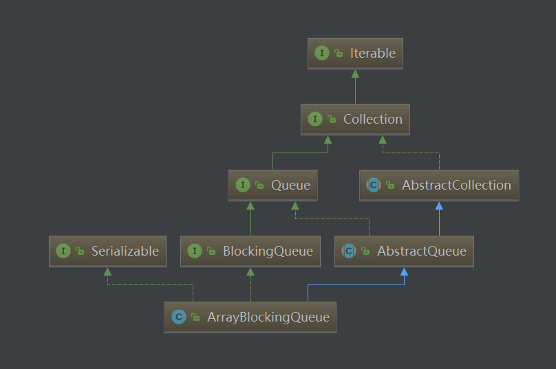

可以结合线程池跟面试官讲一下哦~

### 26. Java 中的 LinkedList 是单向链表还是双向链表？

哈哈，看源码吧，是双向链表

```
    private static class Node<E> {
        E item;
        Node<E> next;
        Node<E> prev;
        Node(Node<E> prev, E element, Node<E> next) {
            this.item = element;
            this.next = next;
            this.prev = prev;
        }
    }

```

### 27. 说一说 ArrayList 的扩容机制吧

ArrayList 扩容的本质就是计算出新的扩容数组的 size 后实例化，并将原有数组内容复制到新数组中去。

```
 public boolean add(E e) {
     //扩容
    ensureCapacityInternal(size + 1);  // Increments modCount!!
    elementData[size++] = e;
    return true;
    }
  private void ensureCapacityInternal(int minCapacity) {
      ensureExplicitCapacity(calculateCapacity(elementData, minCapacity));
}
private static int calculateCapacity(Object[] elementData, int minCapacity) {
        //如果传入的是个空数组则最小容量取默认容量与minCapacity之间的最大值
        if (elementData == DEFAULTCAPACITY_EMPTY_ELEMENTDATA) {
            return Math.max(DEFAULT_CAPACITY, minCapacity);
        }
        return minCapacity;
    }
  private void ensureExplicitCapacity(int minCapacity) {
        modCount++;
        // 如果最小需要空间比elementData的内存空间要大，则需要扩容
        // overflow-conscious code
        if (minCapacity - elementData.length > 0)
            grow(minCapacity);
    }
       private void grow(int minCapacity) {
        // 获取elementData数组的内存空间长度
        int oldCapacity = elementData.length;
        // 扩容至原来的1.5倍
        int newCapacity = oldCapacity + (oldCapacity >> 1);
        //校验容量是否够
        if (newCapacity - minCapacity < 0)
            newCapacity = minCapacity;
        //若预设值大于默认的最大值，检查是否溢出
        if (newCapacity - MAX_ARRAY_SIZE > 0)
            newCapacity = hugeCapacity(minCapacity);
        // 调用Arrays.copyOf方法将elementData数组指向新的内存空间
         //并将elementData的数据复制到新的内存空间
        elementData = Arrays.copyOf(elementData, newCapacity);
    }

```

### 28. HashMap 的长度为什么是 2 的幂次方，以及其他常量定义的含义~

为了能让 HashMap 存取高效，数据分配均匀。

看着呢，以下等式相等，但是位移运算比取余效率高很多呢~

```
hash%length=hash&(length-1)

```

### 29. ConcurrenHashMap 原理？1.8 中为什么要用红黑树？

聊到 ConcurrenHashMap，需要跟面试官聊到安全性，分段锁 segment，为什么放弃了分段锁，与及选择 CAS，其实就是都是从效率和安全性触发，嘻嘻~

```
java8不是用红黑树来管理hashmap,而是在hash值相同的情况下(且重复数量大于8),用红黑树来管理数据。
红黑树相当于排序数据。可以自动的使用二分法进行定位。性能较高。

```

### 30. ArrayList 的默认大小

ArrayList 的默认大小是 10 个元素

```
/**
  * Default initial capacity.
  */
private static final int DEFAULT_CAPACITY = 10;

```

### 31. 为何 Collection 不从 Cloneable 和 Serializable 接口继承？

> *   Collection 表示一个集合，包含了一组对象元素。如何维护它的元素对象是由具体实现来决定的。因为集合的具体形式多种多样，例如 list 允许重复，set 则不允许。而克隆（clone）和序列化（serializable）只对于具体的实体，对象有意义，你不能说去把一个接口，抽象类克隆，序列化甚至反序列化。所以具体的 collection 实现类是否可以克隆，是否可以序列化应该由其自身决定，而不能由其超类强行赋予。
>     
> *   如果 collection 继承了 clone 和 serializable，那么所有的集合实现都会实现这两个接口，而如果某个实现它不需要被克隆，甚至不允许它序列化（序列化有风险），那么就与 collection 矛盾了。
>     

### 32. Enumeration 和 Iterator 接口的区别？

```
public interface Enumeration<E> {
    boolean hasMoreElements();
    E nextElement();
}
public interface Iterator<E> {
    boolean hasNext();
    E next();
    void remove();
}

```

*   函数接口不同
    
*   Enumeration 速度快，占用内存少，但是不是快速失败的，线程不安全。
    
*   Iterator 允许删除底层数据，枚举不允许
    
*   Iterator 安全性高，因为其他线程不能够修改正在被 Iterator 遍历的集合里面的对象。
    

### 33. 我们如何对一组对象进行排序？

可以用 Collections.sort（）+ Comparator.comparing（），因为对对象排序，实际上是对对象的属性排序哈~

```
public class Student {
    private String name;
    private int score;
    public Student(String name, int score){
        this.name = name;
        this.score = score;
    }
    public String getName() {
        return name;
    }
    public void setName(String name) {
        this.name = name;
    }
    public int getScore() {
        return score;
    }
    public void setScore(int score) {
        this.score = score;
    }
    @Override
    public String toString() {
        return "Student: " + this.name + " 分数：" + Integer.toString( this.score );
    }
}
public class Test {
    public static void main(String[] args) {
        List<Student> studentList = new ArrayList<>();
        studentList.add(new Student("D", 90));
        studentList.add(new Student("C", 100));
        studentList.add(new Student("B", 95));
        studentList.add(new Student("A", 95));
        Collections.sort(studentList, Comparator.comparing(Student::getScore).reversed().thenComparing(Student::getName));
        studentList.stream().forEach(p -> System.out.println(p.toString()));
    }
}

```

### 34. 当一个集合被作为参数传递给一个函数时，如何才可以确保函数不能修改它？

这个跟之前那个不可变集合一样道理哈~

> 在作为参数传递之前，使用 Collections.unmodifiableCollection(Collection c) 方法创建一个只读集合，这将确保改变集合的任何操作都会抛出 UnsupportedOperationException。

### 35. 说一下 HashSet 的实现原理？

*   不能保证元素的排列顺序，顺序有可能发生变化。
    
*   元素可以为 null
    
*   hashset 保证元素不重复~ （这个面试官很可能会问什么原理，这个跟 HashMap 有关的哦）
    
*   HashSet，需要谈谈它俩 hashcode() 和 equles() 哦~
    
*   实际是基于 HashMap 实现的，HashSet 底层使用 HashMap 来保存所有元素的
    

看看它的 add 方法吧~

```
    public boolean add(E e) {
        return map.put(e, PRESENT)==null;
    }

```

### 36. Array 和 ArrayList 有何区别？

*   定义一个 Array 时，必须指定数组的数据类型及数组长度，即数组中存放的元素个数固定并且类型相同。
    
*   ArrayList 是动态数组，长度动态可变，会自动扩容。不使用泛型的时候，可以添加不同类型元素。
    

### 37. 为什么 HashMap 中 String、Integer 这样的包装类适合作为 key？

String、Integer 等包装类的特性能够保证 Hash 值的不可更改性和计算准确性，能够有效的减少 Hash 碰撞的几率~

因为

*   它们都是 final 修饰的类，不可变性，保证 key 的不可更改性，不会存在获取 hash 值不同的情况~
    
*   它们内部已重写了 equals()、hashCode() 等方法，遵守了 HashMap 内部的规范
    

### 38. 如果想用 Object 作为 hashMap 的 Key？；

重写 hashCode() 和 equals() 方法啦~ (这个答案来自互联网哈~)

> *   重写 hashCode() 是因为需要计算存储数据的存储位置，需要注意不要试图从散列码计算中排除掉一个对象的关键部分来提高性能，这样虽然能更快但可能会导致更多的 Hash 碰撞；
>     
> *   重写 equals() 方法，需要遵守自反性、对称性、传递性、一致性以及对于任何非 null 的引用值 x，x.equals(null) 必须返回 false 的这几个特性，目的是为了保证 key 在哈希表中的唯一性；
>     

### 39. 讲讲红黑树的特点？

*   每个节点或者是黑色，或者是红色。
    
*   根节点是黑色。
    
*   每个叶子节点（NIL）是黑色。[注意：这里叶子节点，是指为空 (NIL 或 NULL) 的叶子节点！]
    
*   如果一个节点是红色的，则它的子节点必须是黑色的。
    
*   从一个节点到该节点的子孙节点的所有路径上包含相同数目的黑节点。
    

### 40. Java 集合类框架的最佳实践有哪些？

其实这些点，结合平时工作，代码总结讲出来，更容易吸引到面试官呢 (这个答案来自互联网哈~)

> *   1. 根据应用需要正确选择要使用的集合类型对性能非常重要，比如：假如知道元素的大小是固定的，那么选用 Array 类型而不是 ArrayList 类型更为合适。
>     
> *   2. 有些集合类型允许指定初始容量。因此，如果我们能估计出存储的元素的数目，我们可以指定初始容量来避免重新计算 hash 值或者扩容等。
>     
> *   3. 为了类型安全、可读性和健壮性等原因总是要使用泛型。同时，使用泛型还可以避免运行时的 ClassCastException。
>     
> *   4. 使用 JDK 提供的不变类 (immutable class) 作为 Map 的键可以避免为我们自己的类实现 hashCode()和 equals()方法。
>     
> *   5. 编程的时候接口优于实现
>     
> *   6. 底层的集合实际上是空的情况下，返回为长度是 0 的集合或数组而不是 null。
>     

### 41. 谈谈线程池阻塞队列吧~

*   ArrayBlockingQueue
    
*   LinkedBlockingQueue
    
*   DelayQueue
    
*   PriorityBlockingQueue
    
*   SynchronousQueue
    

**ArrayBlockingQueue：** （有界队列）是一个用数组实现的有界阻塞队列，按 FIFO 排序量。

**LinkedBlockingQueue：** （可设置容量队列）基于链表结构的阻塞队列，按 FIFO 排序任务，容量可以选择进行设置，不设置的话，将是一个无边界的阻塞队列，最大长度为 Integer.MAX_VALUE，吞吐量通常要高于 ArrayBlockingQuene；newFixedThreadPool 线程池使用了这个队列

**DelayQueue：**（延迟队列）是一个任务定时周期的延迟执行的队列。根据指定的执行时间从小到大排序，否则根据插入到队列的先后排序。newScheduledThreadPool 线程池使用了这个队列。

**PriorityBlockingQueue：**（优先级队列）是具有优先级的无界阻塞队列；

**SynchronousQueue：**（同步队列）一个不存储元素的阻塞队列，每个插入操作必须等到另一个线程调用移除操作，否则插入操作一直处于阻塞状态，吞吐量通常要高于 LinkedBlockingQuene，newCachedThreadPool 线程池使用了这个队列。针对面试题：线程池都有哪几种工作队列？

我觉得，回答以上几种 ArrayBlockingQueue，LinkedBlockingQueue，SynchronousQueue 等，说出它们的特点，并结合使用到对应队列的常用线程池 (如 newFixedThreadPool 线程池使用 LinkedBlockingQueue)，进行展开阐述， 就可以啦。

### 42. HashSet 和 TreeSet 有什么区别？

*   Hashset 的底层是由哈希表实现的，Treeset 底层是由红黑树实现的。
    
*   HashSet 中的元素没有顺序，TreeSet 保存的元素有顺序性（实现 Comparable 接口）
    
*   HashSet 的 add()，remove()，contains() 方法的时间复杂度是 O(1);TreeSet 中，add()，remove()，contains() 方法的时间复杂度是 O(logn)
    

### 43. Set 里的元素是不能重复的，那么用什么方法来区分重复与否呢? 是用 == 还是 equals()?

元素重复与否是使用 equals() 方法进行判断的，这个可以跟面试官说说 == 和 equals() 的区别，hashcode() 和 equals

### 44. 说出 ArrayList,LinkedList 的存储性能和特性

这道面试题，跟 ArrayList,LinkedList，就是换汤不换药的~

*   ArrayList, 使用数组方式存储数据，查询时，ArrayList 是基于索引 (index) 的数据结构，可以直接映射到，速度较快；但是插入数据需要移动数据，效率就比 LinkedList 慢一点~
    
*   LinkedList, 使用双向链表实现存储, 按索引数据需要进行前向或后向遍历，查询相对 ArrayList 慢一点；但是插入数据速度较快。
    
*   LinkedList 比 ArrayList 开销更大，因为 LinkedList 的节点除了存储数据，还需要存储引用。
    

### 45. HashMap 在 JDK1.7 和 JDK1.8 中有哪些不同？

互联网上这个答案太详细啦（https://www.jianshu.com/p/939b8a672070）

### 46. ArrayList 集合加入 1 万条数据，应该怎么提高效率

> 因为 ArrayList 的底层是数组实现, 并且数组的默认值是 10, 如果插入 10000 条要不断的扩容, 耗费时间, 所以我们调用 ArrayList 的指定容量的构造器方法 ArrayList(int size) 就可以实现不扩容, 就提高了性能。

### 47. 如何对 Object 的 list 排序

看例子吧，哈哈，这个跟对象排序也是一样的呢~

```
public class Person {
    private String name;
    private Integer age;
    public String getName() {
        return name;
    }
    public void setName(String name) {
        this.name = name;
    }
    public Integer getAge() {
        return age;
    }
    public void setAge(Integer age) {
        this.age = age;
    }
    public Person(String name, Integer age) {
        this.name = name;
        this.age = age;
    }
}
public class Test {
    public static void main(String[] args) {
        List<Person> list = new ArrayList<>();
        list.add(new Person("jay", 18));
        list.add(new Person("tianLuo", 10));
        list.stream().forEach(p -> System.out.println(p.getName()+" "+p.getAge()));
        // 用comparing比较对象属性
        list.sort(Comparator.comparing(Person::getAge));
        System.out.println("排序后");
        list.stream().forEach(p -> System.out.print(p.getName()+" "+p.getAge()+" "));
    }
}

```

### 48. ArrayList 和 HashMap 的默认大小是多数？

在 Java 7 中，ArrayList 的默认大小是 10 个元素，HashMap 的默认大小是 16 个元素（必须是 2 的幂）。

### 49. 有没有有顺序的 Map 实现类，如果有，他们是怎么保证有序的

*   Hashmap 和 Hashtable 都不是有序的。
    
*   TreeMap 和 LinkedHashmap 都是有序的。（TreeMap 默认是 key 升序，LinkedHashmap 默认是数据插入顺序）
    
*   TreeMap 是基于比较器 Comparator 来实现有序的。
    
*   LinkedHashmap 是基于链表来实现数据插入有序的。
    

### 50. HashMap 是怎么解决哈希冲突的

> Hashmap 解决 hash 冲突，使用的是链地址法，即数组 + 链表的形式来解决。put 执行首先判断 table[i] 位置，如果为空就直接插入，不为空判断和当前值是否相等，相等就覆盖，如果不相等的话，判断是否是红黑树节点，如果不是，就从 table[i] 位置开始遍历链表，相等覆盖，不相等插入。
